# Collective-Capable AXI4 NoC Target Specification

Revision 0.2, 2026-07-23, draft.

## 1. Overview

A collective-capable, AMBA AXI4-compliant NoC for transformer attention accelerators. One
compute tile per node on a 2D mesh, standard AXI4 at every endpoint.

**Highlights**

- **Hardware multicast** on the write path. Mesh rows share a `Q` operand, columns share a
  `K/V` operand, one injection serves them all: up to **15x** less source-port traffic on a
  16-node set
- **Write-response aggregation.** One AXI response per multicast write, error `BRESP` wins
- **Traffic-class isolation.** Three physical networks, bulk bursts never queue ahead of
  control messages
- **AXI4 endpoints.** Unicast traffic unchanged, a collective write encodes operation and mask
  in `AWUSER`

**Heterogeneous traffic, one network per class**

| Class | Traffic | Properties | Network |
|---|---|---|---|
| High bandwidth | `Q`, `K`, `V` multicast, activations, KV cache blocks | Burst-based, up to 4 KB, latency tolerant | `DAT`, 512 b data plane, high utilization |
| Latency sensitive | Softmax statistics `m` and `l`, synchronization, scheduler start and done | Single-beat messages | Narrow 64 b control plane on `REQ` and `RSP`, low utilization |
| Auxiliary | Data-class requests `DataAr`, acknowledgments `DataB`, the merged multicast `B` | Small fixed-size flits | `REQ` and `RSP` |

---

## 2. Key Features

- 512 b data, **64 GB/s @ 1 GHz**
- Header overhead **7 %**
- Three physical networks `REQ` / `RSP` / `DAT`
- `REQ`/`RSP` full-duplex, W/R utilization **81.4 %** on `DAT`
- Support AXI Outstanding / Interleaving / Out-of-Order
- 2x2 to 16x16 mesh, 256 nodes
- Write multicast / Response reduction support
- 1 to 8 virtual channels, credit-based on `DAT`, ready/valid on `REQ` / `RSP`
- XY routing on all three networks, wormhole switching for the one multi-flit packet type
  (`AW`+`W`; every response packet is single-flit). Deadlock-free for unicast and
  non-overlapping multicast trees; concurrent overlapping multicasts are serialized by
  software (see Scope)
- GALS, per-endpoint clocks

**Scope.**

- A multicast covers an aligned submesh, not an arbitrary node set. Software assigns it, the
  fabric provides the primitive
- Two multicasts whose spanning trees share a node may not be in flight together. Software
  either assigns disjoint trees or waits for the merged `B` before issuing the overlapping one
- Write path only. Reads and read data are always unicast
- No arithmetic on payload anywhere in the fabric. Tiles combine partial results, softmax
  statistics included, over ordinary unicast

---

## 3. Architecture

- Each node holds one compute tile and its local memory, so it is both an AXI master and an AXI slave
- XY routing fixes the path a multicast takes, its merged response retraces that path in reverse

~~~
                 K, V column-wise multicast
                             │
                             ▼
             x0          x1          x2          x3
          ┌───────┐   ┌───────┐   ┌───────┐   ┌───────┐
    y0    │ Tile  │───│ Tile  │───│ Tile  │───│ Tile  │   ──▶ Q row-wise multicast
          └───┬───┘   └───┬───┘   └───┬───┘   └───┬───┘
              │           │           │           │
          ┌───┴───┐   ┌───┴───┐   ┌───┴───┐   ┌───┴───┐
    y1    │ Tile  │───│ Tile  │───│ Tile  │───│ Tile  │
          └───┬───┘   └───┬───┘   └───┬───┘   └───┬───┘
              │           │           │           │
          ┌───┴───┐   ┌───┴───┐   ┌───┴───┐   ┌───┴───┐
    y2    │ Tile  │───│ Tile  │───│ Tile  │───│ Tile  │
          └───┬───┘   └───┬───┘   └───┬───┘   └───┬───┘
              │           │           │           │
          ┌───┴───┐   ┌───┴───┐   ┌───┴───┐   ┌───┴───┐
    y3    │ Tile  │───│ Tile  │───│ Tile  │───│ Tile  │
          └───────┘   └───────┘   └───────┘   └───────┘

          every link, per direction, flit wires only
          REQ 137 b + RSP 127 b + DAT 629 b
          4 x 4 shown, 16 x 16 max
~~~

Inside one node:

~~~
      AXI clk domain       │        NoC clk domain, 1 GHz
                           │
   ┌────────────┐          │   ┌────────────────┐       ┌──────────────┐
   │  Compute   │   AXI4   │   │   Network      │       │    Router    │  REQ  ══▶
   │  tile      │ ────────────▶│   interface    │──────▶│  XY route    │
   │            │  addr 48 │   │                │       │  VC allocate │  RSP  ══▶
   │  (master)  │  ID 8    │   │  address map   │       │  replicate   │  DAT  ══▶
   │            │◀═════════════│  packetize     │◀──────│  merge       │  ◀══ 4 neighbours
   │            │          │   │  depacketize   │       │              │
   └────────────┘          │   │  response order│       │              │
   ┌────────────┐          │   │                │       │              │
   │  Local     │◀─────────────│                │◀──────│              │
   │  memory    │   AXI4   │   └────────────────┘       └──────────────┘
   │  (slave)   │ data 512 │
   └────────────┘          │
~~~

Physically separate networks, not virtual channels on a shared link:

- Independent buffering and arbitration per network, traded against wire count
- Separate `REQ` and `RSP` for forward progress: a node accepts responses while its own request
  path is blocked
- A dedicated wide `DAT` network for the payload channels: a whole beat and its header move in
  one cycle instead of serializing over a narrow link

| Physical link | Size | Narrow class | Data class |
|---|---|---|---|
| `REQ` | 137 b | `Aw`, `Ar`: 48 b address. `W`: 64 b data | `Ar`: 48 b address |
| `RSP` | 127 b | `R`: 64 b data. `B`: 2 b response | `B`: 2 b response |
| `DAT` | 629 b | - | `Aw`: 48 b address. `W`, `R`: 512 b data |

One `DAT` network, not a request and response pair, even though it carries request-direction
`DataW` and response-direction `DataR`:

- The `REQ`/`RSP` split is a correctness requirement, a node must accept responses while its
  own request path is blocked
- A `DAT` endpoint sinks every delivered flit, write data into slave-side buffers, read data
  into reorder-buffer space reserved at request issue, so the two payload flows form no
  blocking cycle
- A split would double the widest wires of the design for no correctness gain

**Network interface (NI).** Two units: NMU serves an AXI master, NSU serves an AXI slave.

- Owns the system address map (SAM): global config space and global memory space
- Address lookup selects the destination node and the AXI class, config space narrow, memory
  space data
- Flit addresses are node-local: the NMU rebases `AxADDR` to the offset within the matched SAM
  region, the NSU presents that zero-based address to the AXI slave. Address decode below the
  node boundary belongs to the endpoint
- Packetizes, depacketizes, orders responses

**Router.** Route selection, multicast replication, response aggregation. No AXI address
decode, no arithmetic on payload.

*NMU (Network Master Unit).* AXI slave interface toward the AXI master, NoC initiator interface
toward the fabric.

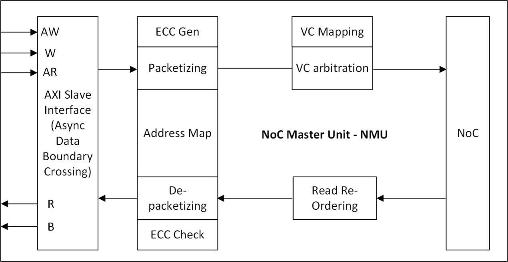

- Request path: `AW`+`W` and `AR` buffers, round-robin arbitration with wormhole lock, SAM
  lookup, packetizer with VC allocation on `DAT`
- Response path: packet buffer, reorder buffer, depacketizer to `B` and `R`
- Same-ID ordering: same-destination streams bypass the reorder buffer and hold one VC end to
  end, different-destination streams reorder through it
- Reorder buffer: 8 KB SRAM, two responses at the AXI 4 KB maximum burst

*NSU (Network Slave Unit).* NoC target interface toward the fabric, AXI master interface toward
the AXI slave.

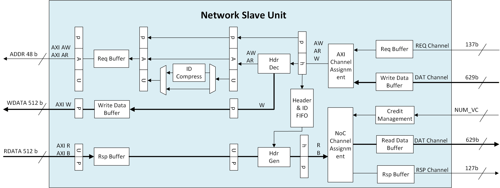

- Request path: packet buffer, ID compression, depacketizer to `AW`, `AR`, `W`
- Header FIFO keeps each transaction's header for response packetization
- Response path: `B` and `R` buffers, round-robin arbitration, packetizer with VC allocation on
  `DAT`
- ID compression fits a narrower downstream ID width. Streams sharing a compressed ID return in
  order

**Router modes.** Both route XY, replicate multicast, merge responses.

- Standard mode: credit-based flow control with virtual channels, 3 to 5 pipeline stages per
  hop, serves `DAT`
- Simple mode: ready/valid, single channel, 1 to 2 pipeline stages per hop, serves `REQ`
  and `RSP`
- Per node: one standard-mode router on `DAT`, one simple-mode router each on `REQ` and `RSP`

**Requirements on the fabric.**

| Requirement | Statement |
|---|---|
| AXI4 response contract | One `B` per `Aw`, and an error `BRESP` takes precedence when a multicast write is answered by several slaves |
| Ordering | Responses reach a master in AXI order within an ID in every configuration |
| Deadlock-free | Guaranteed at one virtual channel per network channel, with multicast enabled |
| Write data pairing | A slave pairs each write request with its own write data, whatever the mix of sources |
| Credit capacity | A credit-controlled receiver holds, per virtual channel, at least one flit of buffer for each cycle of buffer turnaround time. Below that capacity a link idles with no contention present |

---

## 4. Interfaces

| Unit | AXI interface | NoC interface |
|---|---|---|
| NMU | AXI slave interface | NoC initiator interface |
| NSU | AXI master interface | NoC target interface |
| Router | - | NoC link interface per port, one local and four directional (N, E, S, W) |

### 4.1 Global signals

| Signal | Source | Description |
|---|---|---|
| `ACLK` | Clock source | AXI domain clock. AXI port signals are sampled on its rising edge |
| `ARESETn` | Reset source | AXI domain reset, active low, asynchronous |
| `noc_clk` | Clock source | NoC domain clock, 1 GHz target |
| `noc_rst_n` | Reset source | NoC domain reset, active low, asynchronous |

The two domains are asynchronous. The crossing sits at the AXI boundary of the network interface.

### 4.2 AXI channel signals

The NMU and NSU ports carry the same AXI4 channel set at the §5 widths, so the tables below
cover both.

**Write address channel**

| Signal | Width | Source | Description |
|---|---:|---|---|
| `AWID` | 8 | Master | Write address ID |
| `AWADDR` | 48 | Master | Write address |
| `AWLEN` | 8 | Master | Burst length |
| `AWSIZE` | 3 | Master | Burst size |
| `AWBURST` | 2 | Master | Burst type |
| `AWLOCK` | 1 | Master | Lock type |
| `AWCACHE` | 4 | Master | Memory type |
| `AWPROT` | 3 | Master | Protection type |
| `AWQOS` | 4 | Master | QoS identifier |
| `AWREGION` | 4 | Master | Region identifier |
| `AWUSER` | 58 | Master | User signal. 50 bits carry the collective attributes, see §6 |
| `AWVALID` | 1 | Master | Write address valid |
| `AWREADY` | 1 | Slave | Write address ready |

**Write data channel**

| Signal | Width | Source | Description |
|---|---:|---|---|
| `WDATA` | 64 or 512 | Master | Write data, 64 b narrow class, 512 b data class |
| `WSTRB` | 8 or 64 | Master | Write strobes |
| `WLAST` | 1 | Master | Write last, the last transfer in a write burst |
| `WUSER` | 8 | Master | User signal |
| `WVALID` | 1 | Master | Write data valid |
| `WREADY` | 1 | Slave | Write data ready |

**Write response channel**

| Signal | Width | Source | Description |
|---|---:|---|---|
| `BID` | 8 | Slave | Write response ID |
| `BRESP` | 2 | Slave | Write response |
| `BUSER` | 8 | Slave | User signal |
| `BVALID` | 1 | Slave | Write response valid |
| `BREADY` | 1 | Master | Write response ready |

**Read address channel**

| Signal | Width | Source | Description |
|---|---:|---|---|
| `ARID` | 8 | Master | Read address ID |
| `ARADDR` | 48 | Master | Read address |
| `ARLEN` | 8 | Master | Burst length |
| `ARSIZE` | 3 | Master | Burst size |
| `ARBURST` | 2 | Master | Burst type |
| `ARLOCK` | 1 | Master | Lock type |
| `ARCACHE` | 4 | Master | Memory type |
| `ARPROT` | 3 | Master | Protection type |
| `ARQOS` | 4 | Master | QoS identifier |
| `ARREGION` | 4 | Master | Region identifier |
| `ARUSER` | 8 | Master | User signal |
| `ARVALID` | 1 | Master | Read address valid |
| `ARREADY` | 1 | Slave | Read address ready |

**Read data channel**

| Signal | Width | Source | Description |
|---|---:|---|---|
| `RID` | 8 | Slave | Read ID tag |
| `RDATA` | 64 or 512 | Slave | Read data, 64 b narrow class, 512 b data class |
| `RRESP` | 2 | Slave | Read response |
| `RLAST` | 1 | Slave | Read last, the last transfer in a read burst |
| `RUSER` | 8 | Slave | User signal |
| `RVALID` | 1 | Slave | Read data valid |
| `RREADY` | 1 | Master | Read data ready |

### 4.3 NoC link interface

- Each link carries the three physical networks, each an independent signal group per direction.
- `REQ` and `RSP` use ready/valid flow control, per the §3 simple router mode. A flit transfers
  on a cycle where valid and ready are both high.
- `DAT` uses credit-based flow control with no ready signal, per the standard router mode. A
  flit transfers on a cycle where valid is high and the transmitter holds a credit for the
  target virtual channel. The receiver returns one credit per virtual channel as a buffer frees.
- Driven signals reset low.

A port carries one transmit and one receive instance of every network's signal group. Directions
below are from the port's own view. No wire is shared between the two instances.

| Signal | Width | Direction | Description |
|---|---:|---|---|
| `TXREQFLIT` | 137 | Output | `REQ` transmit flit, header and payload |
| `TXREQVALID` | 1 | Output | `REQ` transmit valid |
| `TXREQREADY` | 1 | Input | `REQ` transmit ready, from the receiver |
| `RXREQFLIT` | 137 | Input | `REQ` receive flit |
| `RXREQVALID` | 1 | Input | `REQ` receive valid |
| `RXREQREADY` | 1 | Output | `REQ` receive ready |
| `TXRSPFLIT` | 127 | Output | `RSP` transmit flit, header and payload |
| `TXRSPVALID` | 1 | Output | `RSP` transmit valid |
| `TXRSPREADY` | 1 | Input | `RSP` transmit ready, from the receiver |
| `RXRSPFLIT` | 127 | Input | `RSP` receive flit |
| `RXRSPVALID` | 1 | Input | `RSP` receive valid |
| `RXRSPREADY` | 1 | Output | `RSP` receive ready |
| `TXDATFLIT` | 629 | Output | `DAT` transmit flit, flit type in `axi_ch`, see §6 |
| `TXDATVALID` | 1 | Output | `DAT` transmit valid |
| `TXDATCRDVALID` | `NUM_VC` | Input | `DAT` credit valid, credit return from the receiver, one bit per virtual channel |
| `RXDATFLIT` | 629 | Input | `DAT` receive flit |
| `RXDATVALID` | 1 | Input | `DAT` receive valid |
| `RXDATCRDVALID` | `NUM_VC` | Output | `DAT` credit valid, credit return to the sender |

---

## 5. Attributes and Configuration

**Fixed attributes**

| Attribute | Value | Comments |
|---|---|---|
| Address width | 48 b | - |
| ID width | 8 b | - |
| `AWUSER` width | 58 b | 50 bits hold collective attributes, see §6 |
| `ARUSER`, `WUSER`, `RUSER`, `BUSER` width | 8 b | - |
| Narrow class data width | 64 b | - |
| Data class data width | 512 b | - |

**Configuration options**

| Feature | Parameter | Values (default) | Comments |
|---|---|---|---|
| Topology | Mesh X and Y dimension | 2-16 (4) | Square meshes only. 256 nodes maximum, set by the 8-bit node ID |
| AXI interface | Endpoint interfaces | 1, 2 (1) | One interface carries both classes, with the class selected by the SAM address space. Two carry one class each |
| Flow control | `NUM_VC`, virtual channels per network channel | 1-8 (1) | Sets the §4.3 credit signal width |
| Ordering | Outstanding transactions per ID | 1-32 (32) | 1 when same-ID response reordering is disabled. A master holds at most 256 in total, one per `ordering_tag`, see §6 |
| Ordering | Same-ID response reordering | enabled, disabled (enabled) | The §3 ordering requirement holds in either setting |
| Address map | SAM address spaces | config, memory | Config space selects the narrow class, memory space the data class. Uniform across nodes, loaded at runtime |
| Address map | Space region size | power of two | - |
| Address map | Destination decode | table, offset (table) | Table decode matches an address against the SAM regions. Offset decode reads the node coordinates from fixed address bit ranges. See §5.1 |

### 5.1 Address map requirements

The two modes differ in whether the address carries its destination. Offset decode reads the
coordinates out of fixed bit positions. Table decode does not: the address is one value compared
against every region, and the destination is a property of the region it matched.

```
OFFSET decode, the address is a structured word

  +----------------+--------+--------+--------------------+
  |    RESERVED    |    Y   |    X   |    tile offset     |
  +----------------+--------+--------+--------------------+
                        |        |            |
      dst_id  <---------+--------+            |
      local_addr  <---------------------------+

  Field positions are fixed for the whole map, so every region
  shares one node stride.


TABLE decode, the address is one value

  +--------------------------------------------------------+
  |             compared whole against each region          |
  +--------------------------------------------------------+
                              |
                              v
                        region match
                              |
      dst_id      <-----------+  a property of the region
      AXI class   <-----------+  a property of the region
      local_addr  <-----------+  address minus the region base

  Region boundaries are wherever the map places them. No field
  position is implied and nothing is sliced from the address.
```

| | Table decode | Offset decode |
|---|---|---|
| Destination | a property of the matched region | read from fixed address bits |
| AXI class | a property of the matched region | not derivable |
| Region boundaries | anywhere the map places them | uniform node stride, whole map |
| Address spaces | any number | one |
| Address matching no region | rejected at the NI | not detected |

Offset decode matches no region, so it identifies no address space and selects no AXI class. It
is admissible only for a system carrying one class. A map with both a config and a memory space
requires table decode.

The mode is declared with the address map and validated against it at load.

**Collective targets carry a further requirement.** A collective names its destination set with
an address mask (§6), so the set can only be named if the space keeps its node index in a
contiguous bit field. That holds when the space has one region per node, uniform in size, at a
power-of-two stride, in coordinate order. A space that declares which bits hold X and which hold
Y, and satisfies those conditions, is a legal collective target. A space that does not is still a
legal unicast target.

Under table decode the field position is per space, so the same 48-bit address carries its
coordinates at different bits depending on which space it lands in, and a collective mask sets
its bits at the position belonging to the space its anchor matched. Under offset decode there is
one position and it is the same for every request.

---

## 6. Packet Format

**Flit header, 44 b.**

| Field | Bits | Width | Description |
|---|---|---|---|
| `axi_ch` | [3:0] | 4 | AXI channel of the flit.<br>0: `NarrowAw`, on `REQ`<br>1: `NarrowW`, on `REQ`<br>2: `NarrowAr`, on `REQ`<br>3: `NarrowB`, on `RSP`<br>4: `NarrowR`, on `RSP`<br>5: `DataAw`, on `DAT`<br>6: `DataW`, on `DAT`<br>7: `DataAr`, on `REQ`<br>8: `DataB`, on `RSP`<br>9: `DataR`, on `DAT` |
| `src_id` | [11:4] | 8 | Source node id, composed as `{y[3:0], x[3:0]}` |
| `dst_id` | [19:12] | 8 | Destination node id, same composition |
| `fixed_vc` | [20] | 1 | When asserted, the flit holds `vc_id` end to end and routers do not reallocate it. Set by the NI for ordered same-destination streams |
| `vc_id` | [23:21] | 3 | Virtual channel index, 0 to the configured VC count minus one |
| `flit_tail` | [24] | 1 | Indicates the last flit of a packet |
| `ordering_req` | [25] | 1 | When asserted, `ordering_tag` is valid |
| `ordering_tag` | [33:26] | 8 | Reorder slot handle, allocated per transaction. Bounds a master to 256 outstanding transactions |
| `collective_op` | [35:34] | 2 | Collective operation.<br>0: `UNICAST`, single destination, `collective_mask` zero<br>1: `MULTICAST`, replicate a request to the node set of `collective_mask`, merge its responses, error `BRESP` first<br>2-3: reserved<br>Write path only, `Ar` and `R` are always `UNICAST` |
| `collective_mask` | [43:36] | 8 | Names the multicast node set: wildcard over `dst_id` on a request, `src_id` on its response. Derived from the `AWUSER` address mask |

**Flit payload.**

`addr` in `Aw` and `Ar` carries the node-local offset, `AWADDR` / `ARADDR` minus the matched SAM
region base.

`Aw`, 93 b:

| Field | Bits | Width |
|---|---|---:|
| `id` | [7:0] | 8 |
| `addr` | [55:8] | 48 |
| `len` | [63:56] | 8 |
| `size` | [66:64] | 3 |
| `burst` | [68:67] | 2 |
| `cache` | [72:69] | 4 |
| `lock` | [73] | 1 |
| `prot` | [76:74] | 3 |
| `region` | [80:77] | 4 |
| `qos` | [84:81] | 4 |
| `user` | [92:85] | 8 |

`user` carries `AWUSER[7:0]`, user defined. `AWUSER[57:8]` holds `collective_op` and `collective_mask`, consumed by the NMU at packetize time, not carried in the payload.

`Ar`, 93 b:

| Field | Bits | Width |
|---|---|---:|
| `id` | [7:0] | 8 |
| `addr` | [55:8] | 48 |
| `len` | [63:56] | 8 |
| `size` | [66:64] | 3 |
| `burst` | [68:67] | 2 |
| `cache` | [72:69] | 4 |
| `lock` | [73] | 1 |
| `prot` | [76:74] | 3 |
| `region` | [80:77] | 4 |
| `qos` | [84:81] | 4 |
| `user` | [92:85] | 8 |

`user` carries the full 8 b `ARUSER`.

`NarrowW`, 81 b:

| Field | Bits | Width |
|---|---|---:|
| `last` | [0] | 1 |
| `user` | [8:1] | 8 |
| `strb` | [16:9] | 8 |
| `data` | [80:17] | 64 |

`DataW`, 585 b:

| Field | Bits | Width |
|---|---|---:|
| `last` | [0] | 1 |
| `user` | [8:1] | 8 |
| `strb` | [72:9] | 64 |
| `data` | [584:73] | 512 |

`B`, 18 b:

| Field | Bits | Width |
|---|---|---:|
| `id` | [7:0] | 8 |
| `resp` | [9:8] | 2 |
| `user` | [17:10] | 8 |

`NarrowR`, 83 b:

| Field | Bits | Width |
|---|---|---:|
| `last` | [0] | 1 |
| `id` | [8:1] | 8 |
| `resp` | [10:9] | 2 |
| `user` | [18:11] | 8 |
| `data` | [82:19] | 64 |

`DataR`, 531 b:

| Field | Bits | Width |
|---|---|---:|
| `last` | [0] | 1 |
| `id` | [8:1] | 8 |
| `resp` | [10:9] | 2 |
| `user` | [18:11] | 8 |
| `data` | [530:19] | 512 |

**`AWUSER` layout, 58 b.** `ARUSER` is 8 b.

| Field | Bits | Width |
|---|---|---|
| `user` | [7:0] | 8 |
| `collective_op` | [9:8] | 2 |
| `collective_mask` | [57:10] | 48 |

The `AWUSER` mask is an address mask:

- A set bit marks the matching `AWADDR` bit as don't care, `n` set bits name `2^n` addresses
- Set bits are limited to the node-index field of the address, one aligned region per node, so
  the named addresses differ only in destination node
- The NMU translates the address mask into the 8 b flit `collective_mask` at SAM lookup and
  rejects a mask outside these constraints
- Every replica carries the same node-local offset. Nodes of a multicast group share one local
  address map, and each aperture covers the full burst footprint

**Header overhead and W/R utilization.** Header overhead counts the 44 b header over the flit
width. W and R utilization count the AXI data field over the flit width.

| Network | Header overhead | `W` utilization | `R` utilization |
|---|---:|---:|---:|
| `REQ` 137 b | 32.1 % | 46.7 %, `NarrowW` | - |
| `RSP` 127 b | 34.6 % | - | 50.4 %, `NarrowR` |
| `DAT` 629 b | **7.0 %** | 81.4 %, `DataW` | 81.4 %, `DataR` |

`DataAw` rides `DAT` for ordering, not size: AXI4 write data carries no ID, a slave pairs data
with requests by arrival order, so the request travels bundled ahead of its data. The cost is
one flit per write burst and amortizes over the burst length.

### 6.1 AXI4 Compliance and Ordering

- Full AXI4: INCR, WRAP, and FIXED bursts, narrow and unaligned transfers, `AxLOCK`,
  `AxCACHE`, `AxPROT`, `AxQOS`, `AxREGION`, `xUSER`
- `AxLOCK` is unicast only, a collective transaction is not an exclusive access
- `AWUSER`: 8 b opaque in the flit payload, 50 b collective attributes consumed by the NMU,
  the address mask translated into the flit header, a slave receives the 8 b alone
- Different IDs complete in any order, same ID completes in issue order

---

## 7. Performance

### 7.1 Metrics

| Metric | Definition |
|---|---|
| Channel bandwidth | One flit per cycle per link direction, flit width x clock / 8 |
| Payload bandwidth | AXI payload the same link carries, data width x clock / 8 |
| Payload efficiency | Data beats over flits carried |
| Zero-load latency | Packet latency with no queueing and no contention |
| Sustained bandwidth | Payload bandwidth a channel delivers over a continuous stream |

All figures assume AXI and NoC on one 1 GHz clock, the 512 b data class, and 4 KB bursts.

### 7.2 Payload bandwidth

A physical network carries one flit per cycle per direction and a flit holds at most one beat of
AXI payload.

**AXI interface**, per port:

- Narrow `W`, `R`: 64 b @ 1 GHz = **8 GB/s** each
- Data `W`, `R`: 512 b @ 1 GHz = **64 GB/s** each

**NoC channel**, per link direction:

- `REQ`: flit 137 b @ 1 GHz = 17.1 GB/s channel, 8 GB/s payload
- `RSP`: flit 127 b @ 1 GHz = 15.9 GB/s channel, 8 GB/s payload
- `DAT`: flit 629 b @ 1 GHz = 78.6 GB/s channel, **64 GB/s** payload

- `NarrowW` rides `REQ`, `NarrowR` rides `RSP`: concurrent.
- Each `DAT` direction is its own wire bundle, a node's write data outbound and its read data
  inbound, both at 64 GB/s. Flows sharing one direction split it.

### 7.3 Payload efficiency

A flit carries at most one beat, so the NoC supplies flits, not bits, and the channel bandwidth
above the payload bandwidth buys nothing. The service rate of an AXI channel is the smaller of its
beat rate and the flit rate of the network it maps to:

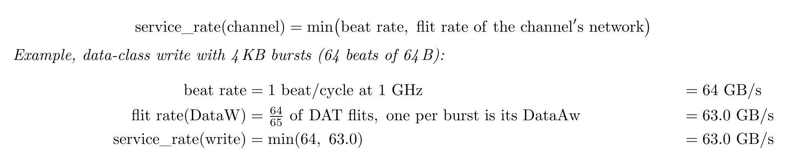

- Write: `DataW` shares the `DAT` network with `DataAw`, one flit per burst, so an `N`-beat
  burst sustains `N/(N + 1)`, 98.5 % at 4 KB, a ceiling of 63.0 GB/s.
- Read: `DataR` has the response-direction `DAT` network to itself, 100 %, the full 64 GB/s.

Input buffering absorbs the `DataAw` flit of an isolated burst as one cycle of added latency. At
an offered rate above the write payload efficiency the deficit accumulates one beat per burst and
backpressure begins once it reaches the buffer depth, at any depth.

### 7.4 Zero-load latency

A packet crossing `H` hops traverses `H` links and passes `H + 1` routers, counting the source
router. Each network has its own router, so `t_router` is per network:

- `REQ` / `RSP`: simple-mode router, ready/valid, **1 to 2** pipeline stages per hop
- `DAT`: standard-mode router, multi-VC credit-based flow control, **3 to 5** pipeline stages
  per hop

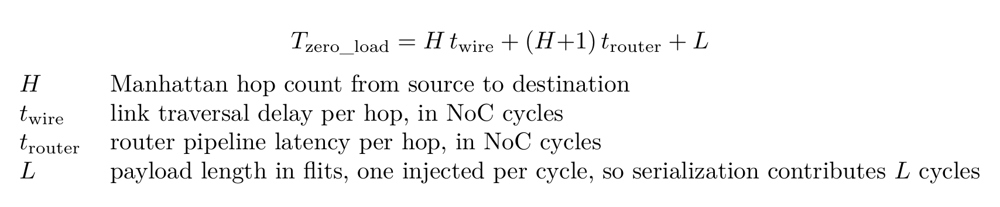

### 7.5 Sustained bandwidth

In-order reads hold the full rate, **64 GB/s**. Out-of-order reads lift efficiency across
destinations, but the reorder-buffer size is their bottleneck: every reordered response
passes through it, and once its **8 KB** is fully allocated the next request waits.

Sustained bandwidth follows two cases, split by whether responses return before the
outstanding depth runs out:

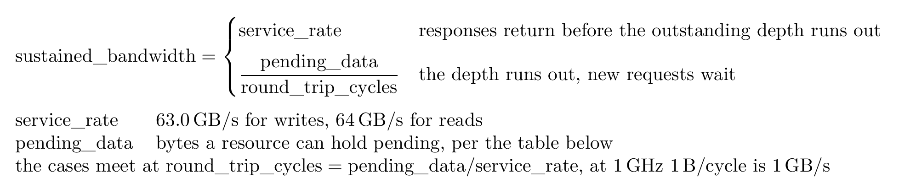

**Write pays in the channel, not in reordering.**

- `Aw` shares `DAT` with its write data: **63.0 GB/s** at 4 KB bursts
- Reordering is free, a `B` response is one flit with nothing to buffer

**Read pays in reordering, not in the channel.**

- Read data owns the response-direction `DAT`: 100 % payload efficiency
- An out-of-order read reserves reorder-buffer space for its whole burst before it issues
- An in-order read, same destination, skips the buffer

Out-of-order read depth, 64 B per beat, against the 32-request cap and the 8 KB buffer:

| Burst size | Outstanding requests | Limited by | Pending data |
|---|---:|---|---:|
| 64 B | 32 | the 32-request cap | 2 KB |
| 256 B | 32 | both at once | 8 KB |
| 1 KB | 8 | the 8 KB buffer | 8 KB |
| 4 KB | 2 | the 8 KB buffer | 8 KB |

---

## 8. Evaluation Model

The evaluation platform is the Edge LPDDR PIM 3D scalable architecture. The NoC under test is the
router mesh and network interfaces of its NPU mesh region.


- Host control region: a scheduler CPU and a sequencer DMA stage data from LPDDR and external
  storage into the mesh.
- NPU mesh region: one tile per node. A tile holds an NPU, its controller, tile-local 3D DRAM,
  and a router.
- The 3D DRAM arrays occupy the top layers. The control and interface logic sits at the base.

Memory tiers, ordered from cold storage to compute:

| Tier | Location | Role |
|---|---|---|
| External storage | Host control region, loaded from Flash | Persistent model store, read once at model load |
| `LPDDR` | External DRAM behind the LPDDR interface | Capacity tier. Holds the model image and feeds weight staging |
| Host `3D DRAM` | Host control region | Bandwidth tier on the host side. KV cache offload target and sink of mesh output |
| Interface buffer | Host control region | Staging buffer between the external interfaces and the sequencer DMA |
| Local SRAM | Host control region | Scheduler working memory, holds DMA descriptors |
| Tile `3D DRAM` | Every mesh tile | Near-memory tier. Resident weights, the tile's `Q`, `K`, `V`, `O` blocks, and hot KV cache. Tile-local, so a source-tile load generates no NoC traffic |
| `L1` | Inside the NPU | Compute scratchpad. Sub-tiles, partial sums, and online-softmax state, filled by tiling with double buffering |

Data moves between tiers on four paths: weights, activations, KV cache, and results. Arrows
crossing a region boundary are NoC traffic on the marked network.

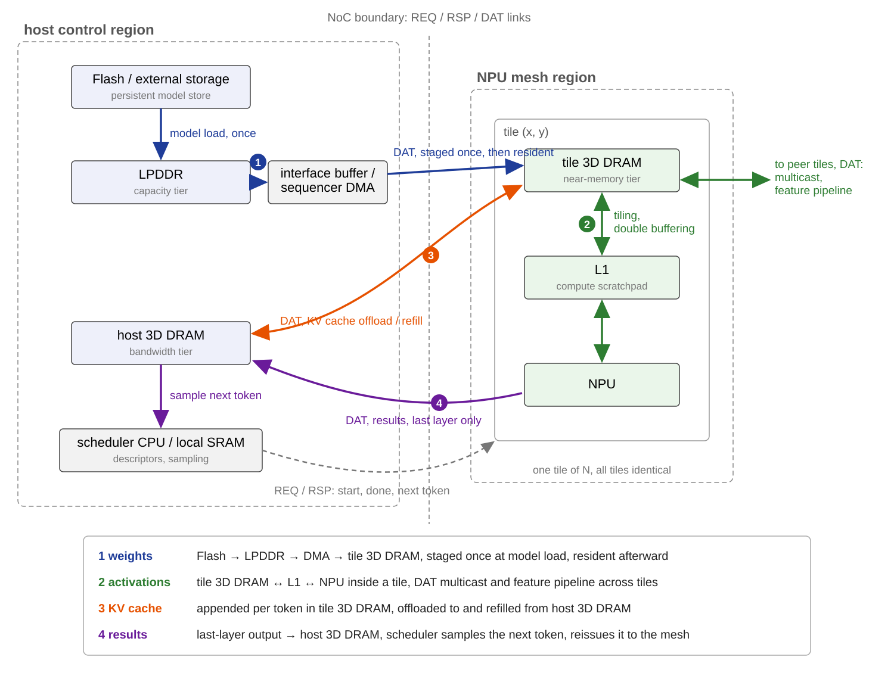

Attention scores never enter this flow: a score block is produced and consumed inside `L1` by
the online softmax, no tier holds it, no NoC traffic carries it.

### 8.1 Tiled attention dataflow

Three algorithms specify the dataflow: model-level execution flow (Algorithm 0) at the run
level, and the attention block it invokes as per-tile fetch (Algorithm 1) or multicast
(Algorithm 2), differing only in how shared operands reach the tile group.

**Attention block mapping.** A tile group computes one attention block: the score grid
`S = Q K^T` maps onto the mesh, rows share `Q`, columns share `K/V`.

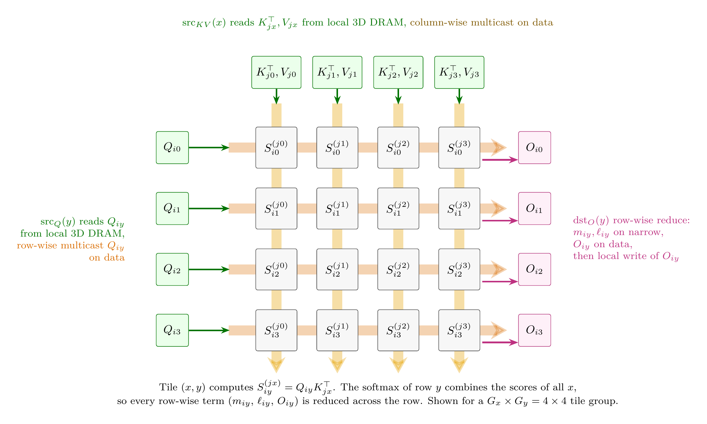

**Model-level execution flow (Algorithm 0).** Weights load once into per-tile 3D DRAM and stay
resident, no layer fetches weights over the fabric (line 1). A layer puts two traffic classes on
the fabric:

- Feature pipeline: activations passed to the next layer, on the data plane (line 9).
- Scheduler control: per-group start and done messages, on the narrow control plane (line 8).

Layers map to tile groups round-robin as pipeline stages. A group holds the weights and KV cache
of its layers, so only the activations `X` cross group boundaries:

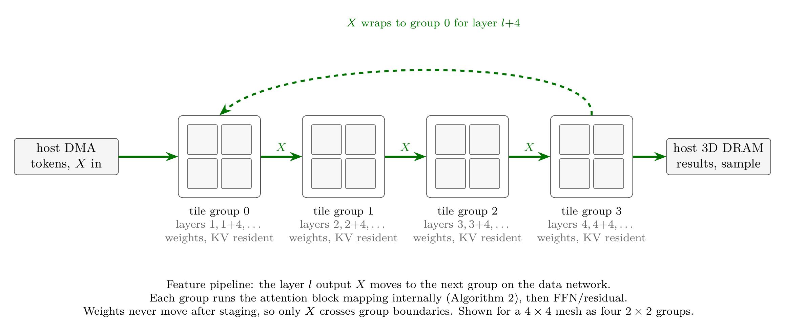

After the last layer the output returns to host 3D DRAM, where the scheduler samples the next
token (line 11). Cold KV cache blocks evict to host 3D DRAM and reload on demand (line 6).

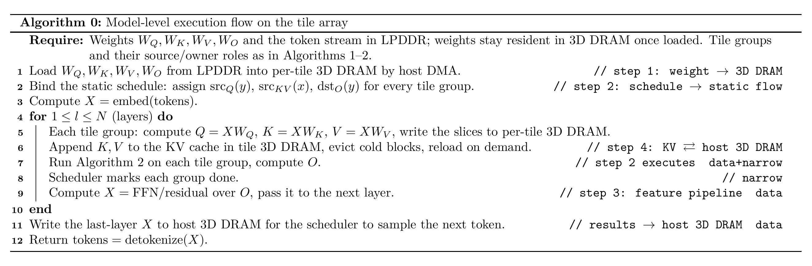

Algorithms 1 and 2 differ in one place, how a shared slice reaches its consumers:

- Algorithm 1 (per-tile fetch): every consumer tile pulls the slice itself, `Gx` unicast reads per
  `Q` slice and `Gy` per `K/V` slice (lines 5 and 7).
- Algorithm 2 (multicast): the source tile reads its slice locally once and multicasts it, one
  transfer per slice (lines 5-6 and 8-9).

In both figures the comments mark plane use: `data` for the `Q`, `K`, `V`, `O` tensors, `narrow`
for the `m` and `l` statistics, `local read/write` for 3D DRAM accesses that generate no NoC
traffic.

**Algorithm 1  Per-tile fetch.**

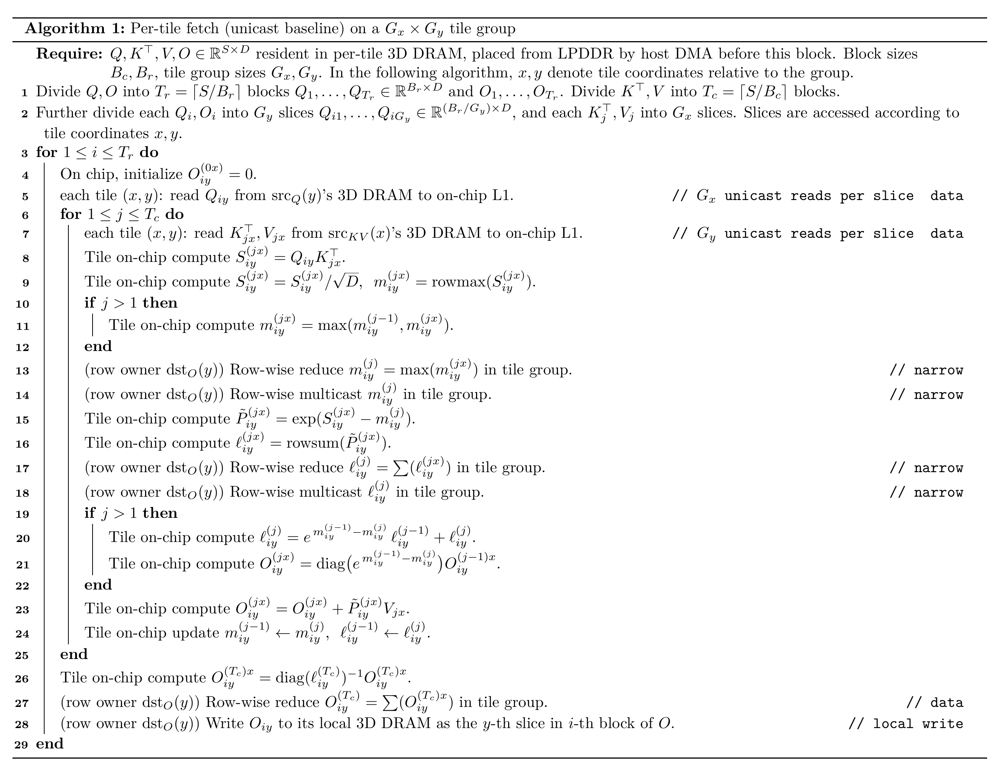

**Algorithm 2  Multicast.**

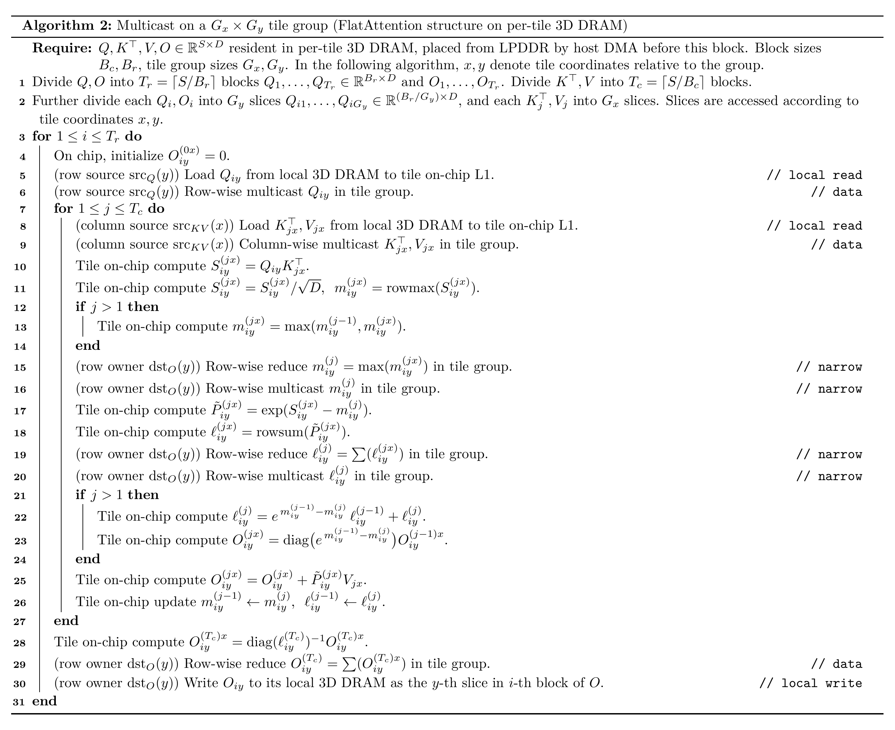

Multicast cuts the shared-operand transfers from `Gx` or `Gy` to one.

### 8.2 Multicast latency and traffic

The row and column multicasts of Algorithm 2 follow the model below, a multicast along one axis
over a set of `k` nodes. A submesh multicast runs in two phases, one per axis.

```text
  k        nodes in the participating row or column
  L        sub-tile payload length in flits, one beat per flit,
           sub-tile bytes / 64 on the data class, / 8 on the narrow class
  H_max    maximum hop count from the source to a member of the set
  s        source index in the set, 0 to k - 1
  t_wire, t_router  per-hop link and router delay, as in the zero-load latency model
```

Tail arrival at the farthest member of the set:

| Case | Latency |
|---|---|
| Repeated unicast | `(k - 1)L + H_max t_wire + (H_max + 1) t_router` |
| In-network multicast | `L + H_max t_wire + (H_max + 1) t_router` |

Traffic generated by one multicast, source at one end of the set:

| Quantity | Unicast | In-network | Ratio, `k = 4` | Ratio, `k = 16` |
|---|---|---|---:|---:|
| Source port flits | `(k - 1)L` | `L` per path | 3x | 15x |
| Flit hops | `L [s(s + 1)/2 + (k - 1 - s)(k - s)/2]` | `L(k - 1)` | 2x | 8x |

The transport term of latency is identical in both cases. Multicast replaces the `(k - 1)L`
serialization at one source port with a single sub-tile, so both the tail latency and the source
traffic fall with the set size. A source at one end of the set uses one path with `H_max = k - 1`. An
interior source uses one path per direction, so `H_max = floor(k/2)`, the port ratio halves, and the
flit-hop ratio drops to 1.33x at `k = 4` and 4.27x at `k = 16`.
