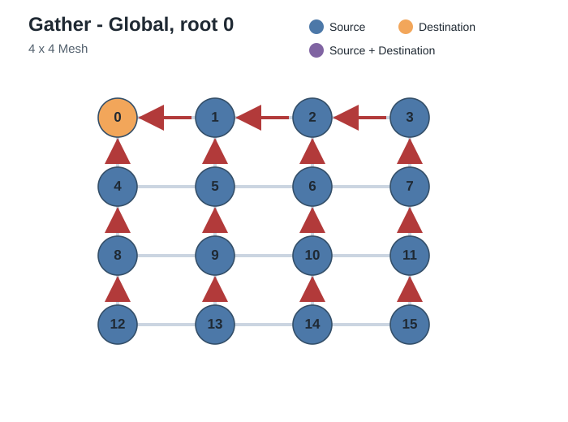
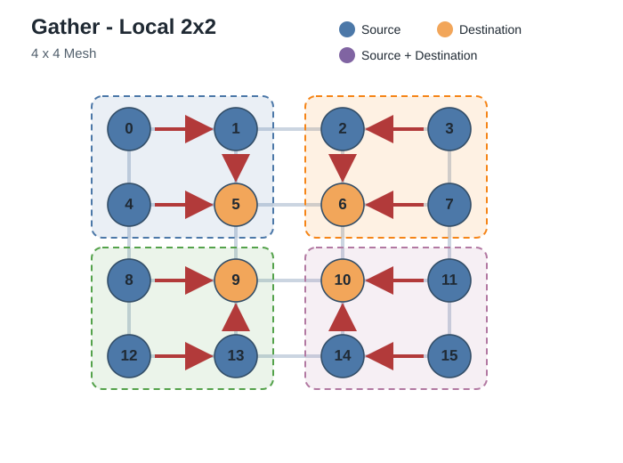
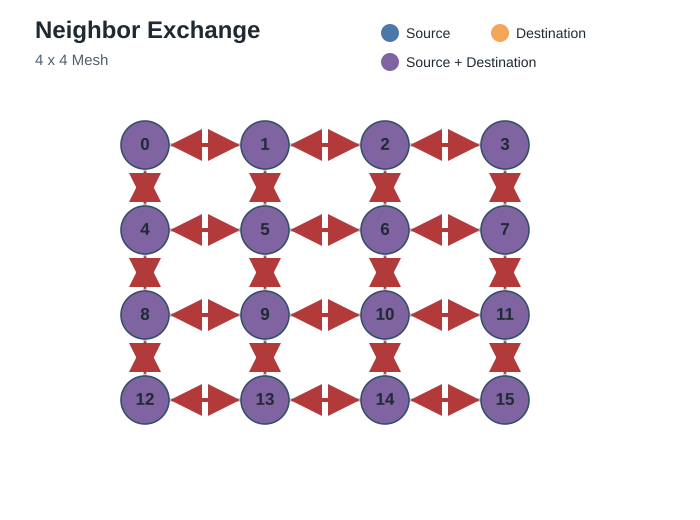
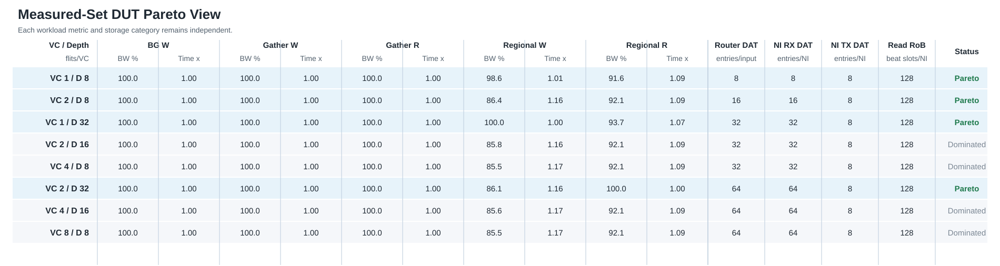

# AI Inference NoC Performance Report — mesh_4x4

## 1. 測試設定與量測方法

- Native AXI data width：512 bits，即 64 B/beat。主表使用 Burst Length 64 beats，因此每筆 transaction 為 4096 B。
- Load control：Outstanding Depth = 32 transactions/initiator。每個 mapping 執行 16 rounds，seed=1。
- Baseline DUT：DAT VCs = 2、Router VC depth = 8 flits/VC、NI RX DAT depth = 8 flits/VC、NI TX DAT depth = 8 entries、Read RoB = 128 beat slots。
- Write slot 從 AW admission 保留到 B。Read slot 從 AR handshake 保留到對應的 RLAST。
- Read memory 與 checker data 在量測前完成 prefill。Read 與 Write 分開執行。

量測流程：

1. 選擇 Communication type 與 Read／Write 方向。
2. 固定 Outstanding Depth 32，各 initiator 持續送出 transaction，直到用滿可用 slot。
3. Write 收到 B 或 Read 收到 RLAST 時釋放一個 slot。
4. 記錄整組 workload 的 completion time、delivered bandwidth 與 DAT-link utilization。

公式：

```text
Transaction bytes = Burst Length * 64 B/beat
Reference transaction bytes = 64 beats * 64 B/beat = 4096 B
Logical delivered bytes = payload deliveries * Transaction bytes
Accepted Throughput (B/cycle) = Logical delivered bytes / Completion Time
Ideal Throughput Bound (B/cycle) = logical delivered bytes / busiest resource serialization cycles
% of Ideal Throughput = Accepted Throughput at Outstanding Depth 32 / Ideal Throughput Bound * 100
DAT-link utilization (%) = transferred DAT flits / measured cycles * 100
```

## 2. AI Communication Types

| Communication type | 量測方向 |
|---|---:|
| Broadcast - Row | Write |
| Broadcast - Column | Write |
| Broadcast - Local 2x2 | Write |
| Broadcast - Global | Write |
| Gather - Global, root 0 | Write / Read |
| Gather - Local 2x2 | Write / Read |
| All-to-All | Write / Read |
| Neighbor Exchange | Write / Read |
| Pipeline P2P | Write / Read |
| Regional Exchange | Write / Read |

箭頭表示 AI payload 的 dataflow 方向。Read 的 request 反向送往資料來源，response 再沿箭頭方向回到 consumer。

| **Broadcast - Row** | **Broadcast - Column** |
|---|---|
|  |  |

| **Broadcast - Local 2x2** | **Broadcast - Global** |
|---|---|
|  |  |

| **Gather - Global, root 0** | **Gather - Local 2x2** |
|---|---|
|  |  |

| **All-to-All** | **Neighbor Exchange** |
|---|---|
|  |  |

| **Pipeline P2P** | **Regional Exchange** |
|---|---|
|  |  |

## 3. Performance Results

Reference configuration：baseline DUT、Burst Length 64 beats、Outstanding Depth 32。

| Communication Type | Direction | Ideal Throughput Bound (B/cycle) | Accepted Throughput at Outstanding Depth 32 (B/cycle) | % of Ideal Throughput |
|---|---:|---:|---:|---:|
| Broadcast - Row | Write | 1008.2 | 628.6 | 62.4 |
| Broadcast - Column | Write | 1008.2 | 628.6 | 62.4 |
| Broadcast - Local 2x2 | Write | 1008.2 | 667.0 | 66.2 |
| Broadcast - Global | Write | 1008.2 | 536.1 | 53.2 |
| Gather - Global, root 0 | Write | 63.0 | 62.9 | 99.7 |
| Gather - Local 2x2 | Write | 252.1 | 249.4 | 99.0 |
| All-to-All | Write | 945.2 | 543.0 | 57.4 |
| Neighbor Exchange | Write | 756.2 | 563.1 | 74.5 |
| Pipeline P2P | Write | 945.2 | 917.9 | 97.1 |
| Regional Exchange | Write | 504.1 | 254.7 | 50.5 |
| Gather - Global, root 0 | Read | 64.0 | 57.2 | 89.4 |
| Gather - Local 2x2 | Read | 256.0 | 233.7 | 91.3 |
| All-to-All | Read | 960.0 | 301.2 | 31.4 |
| Neighbor Exchange | Read | 768.0 | 494.3 | 64.4 |
| Pipeline P2P | Read | 960.0 | 931.8 | 97.1 |
| Regional Exchange | Read | 512.0 | 270.7 | 52.9 |


表格解讀：

1. `Ideal Throughput Bound` 由每個 pattern 的 physical resource serialization 上限決定。
2. `Accepted Throughput` 只取 Outstanding Depth 32 的量測值。
3. `% of Ideal Throughput` 比較同一 Communication Type 與 Direction 的量測值和理想上限。

## 4. Burst Length Characterization

Burst Length 是 workload axis。所有列都使用 baseline DUT（DAT VCs 2、Router／NI RX depth 8）、Outstanding Depth 32，並固定每個 flow/round 為 4096 B。

| Communication Type | Direction | Burst Length (beats) | Transactions/flow/round | Accepted Throughput (B/cycle) | Completion time (cycles/run) |
|---|---:|---:|---:|---:|---:|
| All-to-All | Read | 1 | 64 | 268.5 | 58573 |
| All-to-All | Read | 4 | 16 | 196.8 | 79913 |
| All-to-All | Read | 16 | 4 | 253.9 | 61946 |
| All-to-All | Read | 64 | 1 | 301.2 | 52220 |
| All-to-All | Write | 1 | 64 | 347.7 | 45233 |
| All-to-All | Write | 4 | 16 | 530.4 | 29655 |
| All-to-All | Write | 16 | 4 | 510.1 | 30833 |
| All-to-All | Write | 64 | 1 | 543.0 | 28968 |
| Broadcast - Global | Write | 1 | 64 | 17.4 | 60420 |
| Broadcast - Global | Write | 4 | 16 | 66.0 | 15876 |
| Broadcast - Global | Write | 16 | 4 | 221.2 | 4740 |
| Broadcast - Global | Write | 64 | 1 | 536.1 | 1956 |
| Gather - Global, root 0 | Read | 1 | 64 | 31.6 | 31111 |
| Gather - Global, root 0 | Read | 4 | 16 | 57.6 | 17057 |
| Gather - Global, root 0 | Read | 16 | 4 | 57.2 | 17183 |
| Gather - Global, root 0 | Read | 64 | 1 | 57.2 | 17183 |
| Gather - Global, root 0 | Write | 1 | 64 | 32.0 | 30761 |
| Gather - Global, root 0 | Write | 4 | 16 | 51.1 | 19241 |
| Gather - Global, root 0 | Write | 16 | 4 | 60.1 | 16361 |
| Gather - Global, root 0 | Write | 64 | 1 | 62.9 | 15641 |
| Pipeline P2P | Read | 1 | 64 | 473.1 | 2078 |
| Pipeline P2P | Read | 4 | 16 | 931.8 | 1055 |
| Pipeline P2P | Read | 16 | 4 | 931.8 | 1055 |
| Pipeline P2P | Read | 64 | 1 | 931.8 | 1055 |
| Pipeline P2P | Write | 1 | 64 | 472.8 | 2079 |
| Pipeline P2P | Write | 4 | 16 | 749.8 | 1311 |
| Pipeline P2P | Write | 16 | 4 | 878.5 | 1119 |
| Pipeline P2P | Write | 64 | 1 | 917.9 | 1071 |

## 5. Hardware Multicast vs Repeated Unicast

兩種實作使用相同 baseline DUT、Broadcast producer、member、issue order、AXI-ID policy 與 4096 B/flow/round。

Destination count 包含 producer 本身的 local member；Source injected flits 不計入 B／CollectB。

| Broadcast shape | Destination count | Hardware source injected flits | Hardware Completion time (cycles) | Repeated-unicast source injected flits | Repeated-unicast Completion time (cycles) | Hardware speedup (x) |
|---|---:|---:|---:|---:|---:|---:|
| Broadcast - Row | 4 | 4160 | 1668 | 12480 | 4880 | 2.93 |
| Broadcast - Column | 4 | 4160 | 1668 | 12480 | 4880 | 2.93 |
| Broadcast - Local 2x2 | 4 | 4160 | 1572 | 12480 | 4784 | 3.04 |
| Broadcast - Global | 16 | 1040 | 1956 | 15600 | 17648 | 9.02 |

## 6. VC 與 Buffer Trade-off

Fixed-depth 與 equal-total-entry sweep 比較性能和每個 Router input 的 DAT buffer entries。

```text
DAT buffer entries per Router input = DAT VC count * Router VC depth
```

| DAT VCs | VC depth (flits/VC) | Router DAT entries/input | NI RX DAT entries/NI | Fixed NI TX DAT entries/NI | Read RoB beat slots/NI | Limiting throughput workload | Accepted Throughput retention (%) | Limiting completion workload | Completion Time ratio (x) |
|---|---:|---:|---:|---:|---:|---:|---:|---:|---:|
| 1 | 8 | 8 | 8 | 8 | 128 | Regional Exchange Read | 91.6 | Regional Exchange Read | 1.09 |
| 2 | 8 | 16 | 16 | 8 | 128 | Regional Exchange Write | 86.4 | Regional Exchange Write | 1.16 |
| 1 | 32 | 32 | 32 | 8 | 128 | Regional Exchange Read | 93.7 | Regional Exchange Read | 1.07 |
| 2 | 32 | 64 | 64 | 8 | 128 | Regional Exchange Write | 86.1 | Regional Exchange Write | 1.16 |

- 表格只列 Pareto candidates；任一未列設定都被另一設定在所有成本與性能維度支配。
- Pareto selection uses every workload/direction 的 Accepted Throughput 與 Completion Time 作為獨立 objective；limiting 欄只供顯示。
- Accepted Throughput retention 越高越好；Completion Time ratio 越接近 1.00 越好。
- Router DAT、NI RX DAT、NI TX DAT 與 Read RoB 是獨立成本維度，不相加。
- 尚無 approved PPA limits，因此不從 Pareto candidates 選擇最終設定。

Read RoB 固定為 128 beat slots。HWM 到達 128，但缺少對應的 non-zero admission-stall counter，因此本輪不啟動 Read RoB sweep，也不宣稱 RoB 限制 throughput。



## 7. RR vs RRD

此 64-bit common-payload 測試中，node 0 的 Control probes 位於完整的 Pipeline P2P background interval 內。RR 使用 shared-edge REQ／RSP；RRD 的 background 改走同一 directed geometric edge 的 DAT。

Control Completion Time 從第一次 request `VALID` assertion 開始，到對應的 B/R handshake 結束，因此包含 source admission backpressure。

| Control case | RR mean Completion Time (cycles/transaction) | RRD mean Completion Time (cycles/transaction) | Completion Time reduction (cycles/transaction) | Completion Time reduction (%) |
|---|---:|---:|---:|---:|
| Control Write | 1992.89 | 500.17 | 1492.72 | 74.9 |
| Control Read | 533.01 | 500.55 | 32.46 | 6.1 |

Completion Time reduction = RR mean Completion Time - RRD mean Completion Time；正值表示獨立 DAT 降低 Control blocking。此結果不是 512-bit bandwidth。

## 8. Compute Overlap Coverage

這是 workload 檢查，不是實測 PE utilization。必須先指定 PE compute budget 才能產生數值。

```text
PE compute budget = [TBD] cycles/round
Compute overlap coverage (%) = min(100, PE compute budget / NoC completion cycles * 100)
```

尚未選定 PE compute budget，因此不提供數值。
