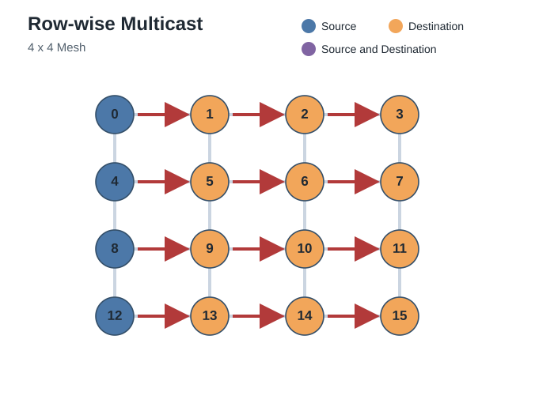
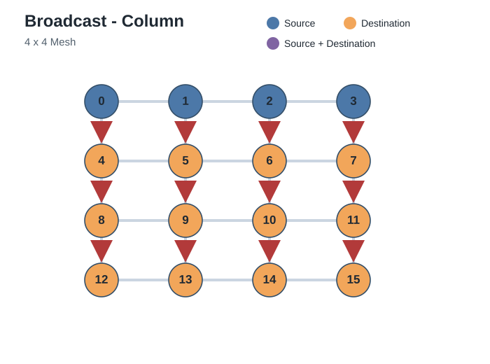
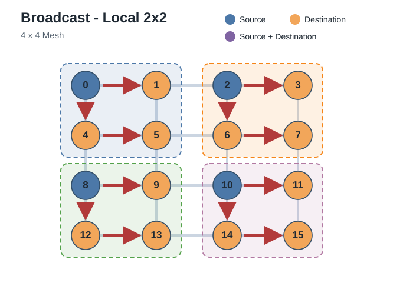
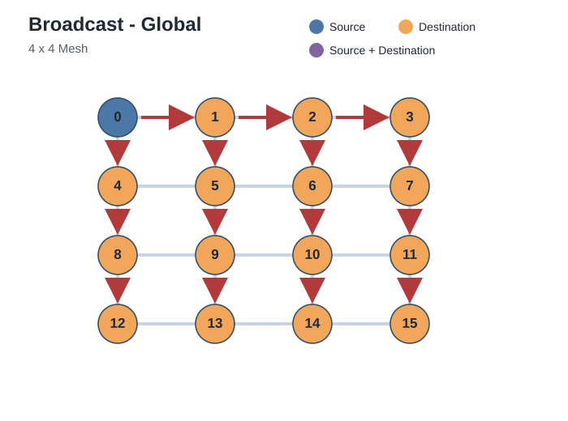
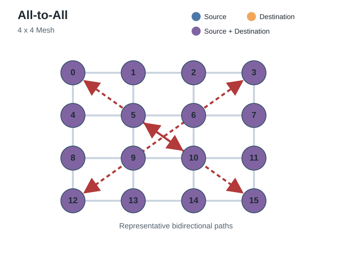
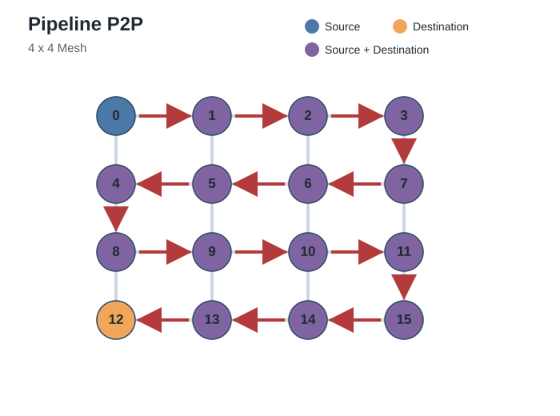
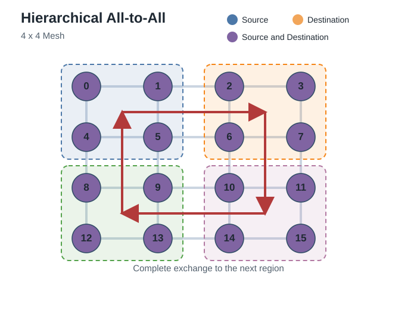
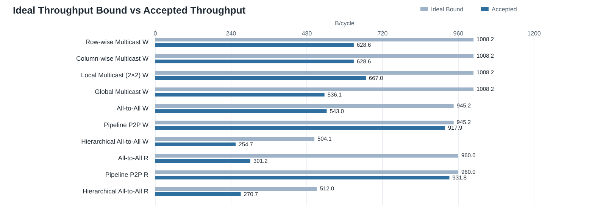

# AI Inference NoC Performance Report: mesh_4x4

## 1. 測試設定與量測方法

- Native AXI data width：512 bits，即 64 B/beat。Reference Burst Length 為 64 beats，每筆 transaction 為 4096 B。
- Load control：Outstanding Depth = 32 transactions/initiator。每個 traffic mapping 執行 16 rounds，seed = 1。
- Reference DUT：DAT VCs = 2、Router VC depth = 8 flits/VC、NI RX DAT depth = 8 flits/VC、NI TX DAT depth = 8 entries、Read RoB = 128 beat slots。
- Write transaction 從 AW admission 佔用一個 slot，收到 B 後釋放。Read transaction 從 AR handshake 佔用一個 slot，收到 RLAST 後釋放。
- Read memory 與 checker data 在量測前完成 prefill。Read 與 Write 分開量測。

量測流程：

1. 選擇 Traffic Model 與 Read／Write 方向。
2. 固定 Outstanding Depth 32。每個 initiator 持續送出 transaction，直到用滿可用 slot。
3. Write 收到 B 或 Read 收到 RLAST 時釋放一個 slot。
4. 記錄整組 workload 的 Completion Time、Accepted Throughput 與 DAT link utilization。

公式：

```text
Transaction bytes = Burst Length * 64 B/beat
Reference transaction bytes = 64 beats * 64 B/beat = 4096 B
Logical delivered bytes = payload deliveries * Transaction bytes
Accepted Throughput (B/cycle) = Logical delivered bytes / Completion Time
Ideal Throughput Bound (B/cycle) = logical delivered bytes / busiest resource serialization cycles
Throughput Efficiency (%) = Accepted Throughput / Ideal Throughput Bound * 100
DAT link utilization (%) = transferred DAT flits / measured cycles * 100
```

## 2. MHA、MoE 與 Pipeline Traffic Models

| Traffic | AI Workload |
|---|---:|
| Multicast | MHA |
| All-Gather | MHA |
| All-to-All | MoE |
| Hierarchical All-to-All | MoE |
| Pipeline P2P | Model Pipeline |

All-Gather traffic schedule 尚未實作，因此欄位標為 [TBD]。既有 Gather 是 many-to-one traffic，不納入本報告。

下圖只顯示已有量測資料的 mapping。Multicast 依 destination group 分成 Row-wise、Column-wise、Local 2×2 與 Global。Hierarchical All-to-All 目前只量到 inter-region phase。箭頭表示 payload 方向。Read request 逆向送往資料來源，response 再沿箭頭方向送到 consumer。

| **Row-wise Multicast** | **Column-wise Multicast** |
|---|---|
|  |  |

| **Local Multicast (2×2)** | **Global Multicast** |
|---|---|
|  |  |

| **All-to-All** | **Pipeline P2P** |
|---|---|
|  |  |

| **Hierarchical All-to-All** |
|---|
|  |

## 3. Performance Results

Reference configuration：Reference DUT、Burst Length 64 beats、Outstanding Depth 32。

| Traffic Model | Direction | Ideal Throughput Bound (B/cycle) | Accepted Throughput (B/cycle) | Throughput Efficiency (%) |
|---|---:|---:|---:|---:|
| Row-wise Multicast | Write | 1008.2 | 628.6 | 62.4 |
| Column-wise Multicast | Write | 1008.2 | 628.6 | 62.4 |
| Local Multicast (2×2) | Write | 1008.2 | 667.0 | 66.2 |
| Global Multicast | Write | 1008.2 | 536.1 | 53.2 |
| All-to-All | Write | 945.2 | 543.0 | 57.4 |
| Pipeline P2P | Write | 945.2 | 917.9 | 97.1 |
| Hierarchical All-to-All | Write | 504.1 | 254.7 | 50.5 |
| All-to-All | Read | 960.0 | 301.2 | 31.4 |
| Pipeline P2P | Read | 960.0 | 931.8 | 97.1 |
| Hierarchical All-to-All | Read | 512.0 | 270.7 | 52.9 |



表格解讀：

1. `Ideal Throughput Bound` 由該 mapping 最忙的 physical resource 決定。
2. `Accepted Throughput` 是 Reference configuration 的量測值。
3. `Throughput Efficiency` 比較同一 Traffic Model 與 Direction 的量測值和理想上限。數值越接近 100% 越好。

## 4. Burst Length Characterization

Burst Length 是 workload parameter，不是 DUT configuration。所有列使用 Reference DUT 與 Outstanding Depth 32。每個 flow 每輪固定傳輸 4096 B。

| Traffic Model | Direction | Burst Length (beats) | Transactions/flow/round | Accepted Throughput (B/cycle) | Completion time (cycles/run) |
|---|---:|---:|---:|---:|---:|
| All-to-All | Read | 1 | 64 | 268.5 | 58573 |
| All-to-All | Read | 4 | 16 | 196.8 | 79913 |
| All-to-All | Read | 16 | 4 | 253.9 | 61946 |
| All-to-All | Read | 64 | 1 | 301.2 | 52220 |
| All-to-All | Write | 1 | 64 | 347.7 | 45233 |
| All-to-All | Write | 4 | 16 | 530.4 | 29655 |
| All-to-All | Write | 16 | 4 | 510.1 | 30833 |
| All-to-All | Write | 64 | 1 | 543.0 | 28968 |
| Global Multicast | Write | 1 | 64 | 17.4 | 60420 |
| Global Multicast | Write | 4 | 16 | 66.0 | 15876 |
| Global Multicast | Write | 16 | 4 | 221.2 | 4740 |
| Global Multicast | Write | 64 | 1 | 536.1 | 1956 |
| Pipeline P2P | Read | 1 | 64 | 473.1 | 2078 |
| Pipeline P2P | Read | 4 | 16 | 931.8 | 1055 |
| Pipeline P2P | Read | 16 | 4 | 931.8 | 1055 |
| Pipeline P2P | Read | 64 | 1 | 931.8 | 1055 |
| Pipeline P2P | Write | 1 | 64 | 472.8 | 2079 |
| Pipeline P2P | Write | 4 | 16 | 749.8 | 1311 |
| Pipeline P2P | Write | 16 | 4 | 878.5 | 1119 |
| Pipeline P2P | Write | 64 | 1 | 917.9 | 1071 |

## 5. Multicast vs Repeated Unicast

本節使用 Write traffic。兩種模式使用相同 Reference DUT、source、Destination Set、issue order、AXI-ID policy 與 4096 B/flow/round。Outstanding Depth 固定為 32，共執行 16 rounds。

量測流程：

1. 所有 active sources 在同一個 cycle 開始發送。
2. Multicast 每個 source 每個 round 發出一筆 Write transaction。Router 在路徑分叉處複製 flit。
3. Repeated Unicast 對每個 destination 發出一筆獨立 Write transaction，最多保留 32 筆 outstanding transactions。
4. 最後一個 active source 收到所有 B responses 時結束量測。

```text
Injected Flits = sum of DAT flits at source injection ports
Completion Time = final B completion cycle - common start cycle
Speedup = Repeated Unicast Completion Time / Multicast Completion Time
```

Fanout 包含 source 本身。Local delivery 不經過 mesh link。Injected Flits 不包含 B／CollectB。

每個 node 的 payload：

```text
Payload per destination per round = 64 beats * 64 B/beat = 4096 B = 4 KiB
Payload per destination per run = 4096 B * 16 rounds = 65536 B = 64 KiB
```

Injected Flits 對應方式：

```text
DAT flits per transaction = 1 header flit + Burst Length
Multicast Injected Flits = Source Count * Rounds * (1 + Burst Length)
Repeated Unicast Injected Flits = Source Count * Rounds * (Fanout - 1) * (1 + Burst Length)
Injection Ratio = Repeated Unicast Injected Flits / Multicast Injected Flits = Fanout - 1

Burst Length = 64 beats, so each Write transaction injects 65 DAT flits
Row-wise Multicast = 4 * 16 * 65 = 4160 flits
Row-wise Repeated Unicast = 4 * 16 * 3 * 65 = 12480 flits
Global Multicast = 1 * 16 * 65 = 1040 flits
Global Repeated Unicast = 1 * 16 * 15 * 65 = 15600 flits
```

| Destination Set | Fanout | Multicast Injected Flits | Multicast Completion Time (cycles) | Repeated Unicast Injected Flits | Repeated Unicast Completion Time (cycles) | Speedup (×) |
|---|---:|---:|---:|---:|---:|---:|
| Row-wise Multicast | 4 | 4160 | 1668 | 12480 | 4880 | 2.93 |
| Column-wise Multicast | 4 | 4160 | 1668 | 12480 | 4880 | 2.93 |
| Local Multicast (2×2) | 4 | 4160 | 1572 | 12480 | 4784 | 3.04 |
| Global Multicast | 16 | 1040 | 1956 | 15600 | 17648 | 9.02 |

## 6. VC 與 Buffer Trade-off

本表比較 DAT VC count、VC depth、DAT Router buffer capacity 與 NI RX DAT buffer capacity。只使用已有 trade-off 量測的 Global Multicast 和 Hierarchical All-to-All。

```text
DAT Router Buffer Capacity = DAT VC count × Router VC depth
```

固定條件：NI TX DAT depth = 8 entries/NI。Read RoB depth = 128 beat slots/NI。

```text
Normalized Throughput = measured throughput / highest measured throughput
Normalized Completion Time = measured completion time / fastest measured completion time
```

- Pareto-dominates：所有量測項目都不差，且至少一項更好。
- Non-dominated：沒有其他 measured configuration 可以 Pareto-dominate 該設定。
- Dominated：至少有一個 measured configuration 可以 Pareto-dominate 該設定。
- Measured non-dominated set：所有 Non-dominated measured configurations 的集合。
- 每個 workload 與 direction 都是獨立 objective。括號內列出該設定表現最差的 workload。
- Normalized throughput 越接近 100% 越好。Normalized completion time 越接近 1.00× 越好。
- Router DAT、NI RX DAT、NI TX DAT 與 Read RoB 是不同的儲存成本，不可直接相加。
- 目前沒有 PPA limit，因此表格不指定最終 DUT configuration。

| DAT configuration | Performance Improvement vs Previous Configuration | Min. Normalized Throughput (%) | Max. Normalized Completion Time (×) |
|---|---:|---:|---:|
| 1 VC × 8 flits | Baseline | 91.6 (Hierarchical All-to-All Read) | 1.09 (Hierarchical All-to-All Read) |
| 2 VC × 8 flits | Read: higher Throughput, lower Completion Time | 86.4 (Hierarchical All-to-All Write) | 1.16 (Hierarchical All-to-All Write) |
| 1 VC × 32 flits | Write: higher Throughput, lower Completion Time<br>Read: higher Throughput, lower Completion Time | 93.7 (Hierarchical All-to-All Read) | 1.07 (Hierarchical All-to-All Read) |
| 2 VC × 32 flits | Read: higher Throughput, lower Completion Time | 86.1 (Hierarchical All-to-All Write) | 1.16 (Hierarchical All-to-All Write) |


圖表解讀：

1. X 軸越往右代表每個 Router input 配置更多 DAT buffer flits。這是 storage cost，不是 synthesis area。
2. Y 軸越高代表相同 workload 在每個 cycle 完成更多 payload bytes。
3. Non-dominated configuration 無法在成本不增加的條件下繼續提升所有量測性能。
4. Dominated configuration 的成本不低，且 Read 與 Write performance 都可由其他設定取代。

Read RoB 固定為 128 beat slots。HWM 到達 128，但沒有對應的 non-zero admission-stall counter。本輪不執行 Read RoB sweep，也不判定 RoB 限制 throughput。

### DUT Configuration Performance

Cell = Measured / Ideal (Efficiency)

Unit: B/cycle

| Config | Multicast W | Hier. A2A W | Hier. A2A R |
|---|---:|---:|---:|
| 1 VC × 8 | 536 / 1008 (53%) | 291 / 504 (58%) | 269 / 512 (53%) |
| 2 VC × 8 | 536 / 1008 (53%) | 255 / 504 (51%) | 271 / 512 (53%) |
| 1 VC × 32 | 536 / 1008 (53%) | 295 / 504 (58%) | 275 / 512 (54%) |
| 2 VC × 16 | 536 / 1008 (53%) | 253 / 504 (50%) | 271 / 512 (53%) |
| 4 VC × 8 | 536 / 1008 (53%) | 252 / 504 (50%) | 271 / 512 (53%) |
| 2 VC × 32 | 536 / 1008 (53%) | 254 / 504 (50%) | 294 / 512 (57%) |
| 4 VC × 16 | 536 / 1008 (53%) | 252 / 504 (50%) | 271 / 512 (53%) |
| 8 VC × 8 | 536 / 1008 (53%) | 252 / 504 (50%) | 271 / 512 (53%) |

## 7. RR vs RRD

此 64-bit common-payload 測試把 node 0 的 Control probe 放在完整的 Pipeline P2P background interval 內。RR 讓 background 與 Control 共用 REQ／RSP。RRD 讓 background 改走相同 directed geometric edge 的 DAT。

Control Completion Time 從第一次 request `VALID` assertion 開始，到對應的 B/R handshake 結束，包含 source admission backpressure。

| Control case | RR mean Completion Time (cycles/transaction) | RRD mean Completion Time (cycles/transaction) | Completion Time reduction (cycles/transaction) | Completion Time reduction (%) |
|---|---:|---:|---:|---:|
| Control Write | 1992.89 | 500.17 | 1492.72 | 74.9 |
| Control Read | 533.01 | 500.55 | 32.46 | 6.1 |

Completion Time reduction = RR mean Completion Time - RRD mean Completion Time。正值表示獨立 DAT 降低 Control blocking。此結果不代表 512-bit bandwidth。

## 8. Compute Overlap Coverage

此項比較 NoC Completion Time 與指定的 PE compute budget，不是實測 PE utilization。

```text
PE compute budget = [TBD] cycles/round
Compute overlap coverage (%) = min(100, PE compute budget / NoC completion cycles * 100)
```

PE compute budget 尚未定義，因此不提供數值。
