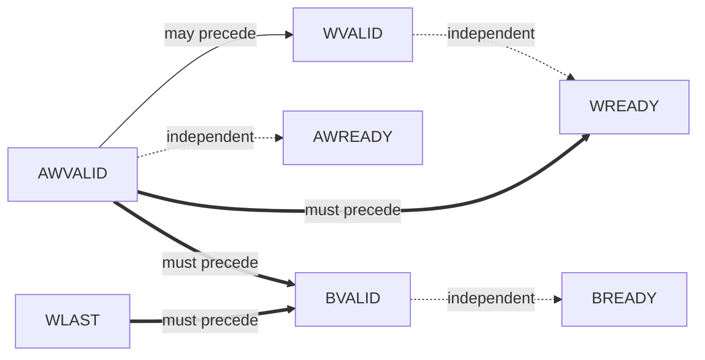
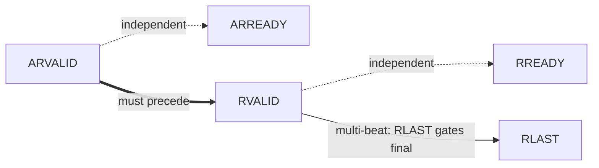
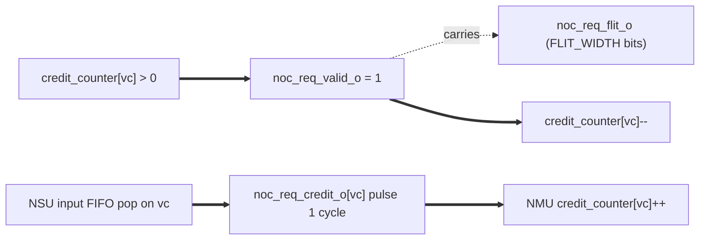
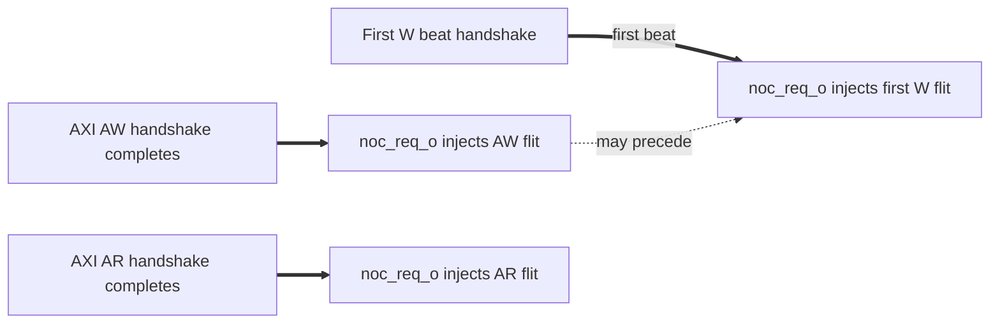

# Channel Handshake & Dependencies

The NI bridges two protocols. Handshake / dependency analysis is split:
- AXI4 host side: standard 5-channel valid/ready dependencies (per ARM AMBA AXI Specification §A3.3)
- NoC side: simpler 2-link valid/ready handshake (per noc_*_o / noc_*_i pairs)
- Cross-protocol: AXI ↔ flit transformation ordering inside NMU and NSU

## Arrow convention

Per ARM AMBA AXI Specification §A3.3 (reuse for all valid/ready handshake protocols here):
- `A --> B`: source A *may* assert before destination B (permissive)
- `A ==> B`: source A *must* assert before destination B (mandatory; reversal is a violation, has corresponding `XCH` rule in `protocol_rules.md`)

## AXI4 host-side dependencies

### Write transaction (AW + W → B)

#### Dependency diagram

#### Textual dependency list

- AWVALID assertion may precede WVALID assertion (write address may issue before, simultaneous with, or after data).
- AWVALID assertion may precede or follow AWREADY (both VALID-before-READY and READY-before-VALID are legal).
- WVALID assertion may precede or follow WREADY (same).
- AWVALID handshake must precede WREADY for the corresponding write — NSU does not accept W phase before AW phase. Rule: `AXI4_SLV_XCH_W_AFTER_AW`.
- AWVALID handshake must precede BVALID. Rule: `AXI4_SLV_XCH_B_AFTER_AW_AND_W`.
- WLAST observation must precede BVALID (slave cannot respond before all write data has arrived). Rule: `AXI4_SLV_XCH_B_AFTER_AW_AND_W`.
- BVALID may precede or follow BREADY.

#### Deadlock-avoidance commentary

NMU and NSU each register all VALID and READY outputs. No combinational path between an inbound VALID and the same NI's outbound READY. WREADY is held LOW only until the corresponding AW phase completes; WREADY is **not** chained on BREADY — NMU does not gate WREADY on BREADY observation.

The NMU's RoB enforces single-outstanding-per-AXI-ID semantics on the master side; NSU enforces ordering on the slave side via MetaBuffer. See `theory_of_operation.md` §RoB.

### Read transaction (AR → R)

#### Dependency diagram

#### Textual dependency list

- ARVALID assertion may precede or follow ARREADY.
- ARVALID handshake must precede RVALID. Rule: `AXI4_SLV_XCH_R_AFTER_AR`.
- For multi-beat reads (ARLEN > 0), all R beats must follow the AR handshake; the final R beat carries `RLAST = 1`. Rule: `AXI4_SLV_XCH_R_LAST_CONSISTENT`.
- RVALID may precede or follow RREADY.

#### Deadlock-avoidance commentary

ARREADY is registered. R burst is wormhole — once started, NMU drives R-beat sequence with RLAST gating the burst end; routers lock the path until RLAST.

## NoC side dependencies

NoC links use credit-based flow control. No per-cycle valid/ready handshake. Per-VC credit accounting decouples sender from receiver buffer state. After reset, both ends must complete a bi-directional credit-init-ready handshake (per `NOC_CREDIT_STARTUP_HANDSHAKE`) before any flit may be injected.

### Request link (noc_req_*)

#### Dependency diagram

#### Textual dependency list

- NMU MUST hold credit > 0 on the chosen VC before asserting `noc_req_valid_o` (per `NOC_MST_FLIT_ON_CREDIT_ONLY`). The credit counter for that VC decrements by 1 on the cycle `noc_req_valid_o = 1`.
- `noc_req_flit_o[FLIT_WIDTH-1:0]` carries the flit data on the same cycle as `noc_req_valid_o = 1`. The flit slot is single-cycle. There is no multi-cycle stall on the wire — credit accounting is the only back-pressure mechanism.
- NSU returns one credit per cycle per VC on `noc_req_credit_o[vc]` after popping a flit from its per-VC input buffer ("up to one credit per cycle, per virtual channel"). Credit return on the reverse path is independent of valid/flit on the forward path.
- The `vc_id` for each flit is encoded in the flit header (see `packet_format.md` §1.2). Forward data link is shared across VCs; multiplexing is at the source via Hybrid R/W × QoS mapping (per `NOC_VC_MAPPING_HYBRID_RW_QOS`).

### Response link (noc_rsp_*)

Mirror of Request link with `noc_rsp_*` prefix. NSU credit gates injection on `noc_rsp_valid_o`. NMU returns credit on `noc_rsp_credit_o`.

### Cross-link

Request and response links are **independent**. A request flit may be in flight on `noc_req_o` while a response flit arrives on `noc_rsp_i` simultaneously (both directions concurrently). No NI-level ordering between request and response links beyond the per-transaction logical correspondence (a request issued generates an eventual matching response).

## Cross-protocol (AXI ↔ flit) transformation ordering

These rules govern the NI internal ordering between AXI handshakes and flit injections / receptions.

### NMU forward path: AXI request → NoC request flit

- AXI AW handshake must precede the corresponding AW flit injection (NMU pulls the address from the handshake before packing the flit).
- W flit injection may interleave with AW flit injection in time on `noc_req_o` (both go on same link); ordering between AW and W flits at the NMU output is FIFO-natural.
- AR injection on `noc_req_o` is wormhole-locked-out while a W burst is in progress on the same link: the NMU injection arbiter holds the W-packet slot until the W burst's `last=1` flit is accepted before granting any other packet (next AW, next W, or AR). See `theory_of_operation.md` §"AR-during-W ordering" for rationale and `protocol_rules.md` `NOC_MST_WORMHOLE_LOCK` for the formal rule.

### NSU forward path: NoC request flit → AXI request

- NoC `noc_req_i` AW flit reception → reconstructs AW phase → drives `axi_req_o.aw*` and `axi_req_o.awvalid` per AXI4 channel rules.
- NoC `noc_req_i` W flit reception → adds beat to W reassembly buffer → when last beat received, drives W phase to `axi_req_o.w*`.
- Ordering: AW flit must arrive before any matching W flit (FIFO-natural at injection); NSU enforces W-after-AW via XCH rule.

### NMU return path: NoC response flit → AXI response

- NoC `noc_rsp_i` B flit reception → updates RoB entry → per-AXI-ID order release → drives `axi_rsp_o.b*` and `bvalid`.
- NoC `noc_rsp_i` R flit reception → accumulates rdata beats; final beat (RLAST in flit) → RoB release → drives `axi_rsp_o.r*` per beat.

### NSU return path: AXI response → NoC response flit

- `axi_rsp_i.bvalid` handshake → ECC generated (B has no data; ECC field unused) → `noc_rsp_o` B flit injection. NSU populates `qos` from `MetaBuffer`.
- `axi_rsp_i.rvalid` handshake (per beat) → ECC generated over `rdata` → R flit injected per beat → final beat carries `rlast=1` flag in flit header.

## Out-of-order completion

- **AXI host side**: per-AXI-ID ordering is preserved by NMU's RoB. Different AXI IDs may complete out of order. NSU completes locally in issue order (single-port AXI slave assumption).
- **NoC side**: routers preserve flit order along same source / destination route within same `qos`; flits with different routes or different `qos` may interleave / overtake.
- **Cross-protocol**: flit reception order from `noc_rsp_i` may not match request injection order at `noc_req_o` (RoB reorders into AXI per-ID order). The RoB is the gatekeeper.

**QoS-aware arbitration**: this NI design extends standard wormhole arbitration with a QoS-priority comparator stage before the round-robin fallback among same-priority flits. Wormhole no-preemption (lock-in until packet `last=1` per `NOC_MST_WORMHOLE_LOCK`) is preserved. Refer to `docs/design/06_qos.md §5` for the QoS-aware arbitration policy and `docs/design/03_router.md` for the router arbiter contract.
