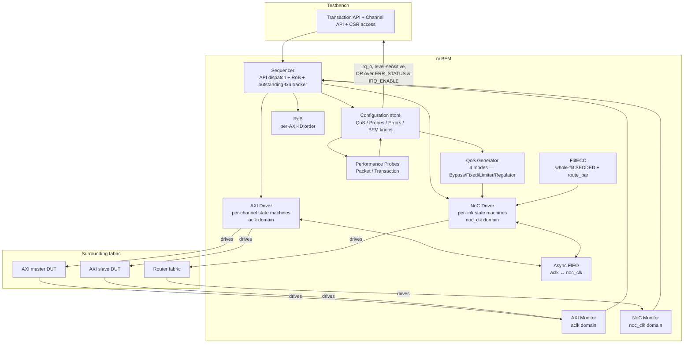
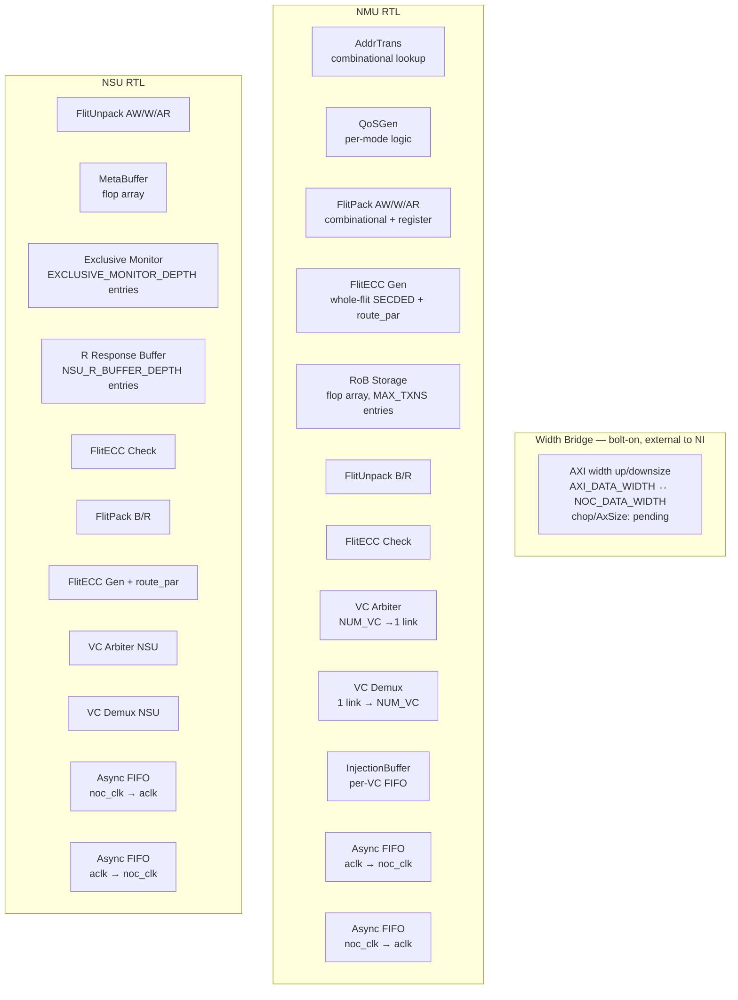

# Theory of Operation

## Block diagram



The `CFG → TB` edge labelled `irq_o` represents the level-sensitive interrupt output asserted when any unmasked `ERR_STATUS` bit is set. Software ISR in the testbench reads `ERR_STATUS` to disambiguate the event class and `LAST_ERR_INFO` for the offending-transaction context. Per `protocol_rules.md` `NI_IRQ_LEVEL`.

## BFM internal architecture

This section is **always required** in protocol-bfm mode.

### Driver

The BFM has **two driver instances** running in different clock domains:

- **AXI Driver** (in `aclk_i` domain): owns per-channel state machines for AW/W/B/AR/R on both slave port (`axi_*_i`) and master port (`axi_*_o`). Plus AXI4-Lite state machine for the CSR port. Fully registered outputs.
- **NoC Driver** (in `noc_clk_i` domain): owns per-link state machines for `noc_req_o` (valid + flit + per-VC credit return + credit-init handshake) and `noc_rsp_o` (mirror). Fully registered outputs.

Both drivers are disabled when `bfm_mode == PASSIVE`; outputs follow `pin_level_reset.md` during-reset values.

### Monitor

Two monitor instances, one per clock domain. Same activity in active and passive modes.

- **AXI Monitor**: samples all 5 channels of both AXI ports + CSR port. Reconstructs full AXI transactions. Reports violations per `protocol_rules.md` `AXI4_*` rules.
- **NoC Monitor**: samples both NoC links in both directions. Reconstructs full flit packets (header + payload). Validates ECC fields. Reports violations per `NOC_*` rules.

### MetaBuffer (NSU sub-block)

NSU-side store that snapshots the original request's header on AW/AR flit reception, retrievable when the corresponding response is generated. Previously called `ReqInfoStore` in earlier drafts.

Holds at minimum:

| Field | Source | Used by |
|-------|--------|---------|
| `rob_idx` | request flit header | Response flit header (per `NOC_FLIT_RSP_ROB_IDX_INHERIT`) |
| `src_id` | request flit header | Response flit header (routes back to NMU's node) |
| `qos` | request flit header | Response flit header (per `NOC_FLIT_RSP_QOS_INHERIT`) |
| `axi_id` | request flit payload | Response flit payload (B/R `bid`/`rid`) |

Capacity: equal to NSU outstanding-transaction limit (`MAX_TXNS`-bounded). Implements one entry per outstanding NSU request; FREE entries reused after corresponding response injected.

**Indexing**: MetaBuffer is indexed by master AXI ID (the `axi_id` field of the request payload). `ID_WIDTH = IN_ID_WIDTH`, `CAPACITY = MAX_TXNS`. Each unique `axi_id` has its own FIFO ordering chain within the queue. Same-ID transactions release in issue order naturally. Cross-ID transactions release in slave-side arrival order.

NSU drives the local AXI slave with the master's original `axi_id` (no internal ID translation). Slave returns B / R with that same `axi_id`. NSU uses it to look up MetaBuffer at response generation time.

**System-level integrator constraint**: AXI IDs MUST be unique across all NMUs targeting any given NSU. The system either assigns disjoint `axi_id` ranges per NMU, or relies on NMU-side ID re-tagging before NoC injection. This guarantee permits indexing by `axi_id` alone without disambiguation by `src_id`. **Designer-confirmed (D1→D2 ambiguity triage, 2026-05-10): index by axi_id; system-level non-overlapping axi_id is integrator's responsibility.**

### NSU Read response buffer (NSU sub-block)

Per-AXI-ID elastic buffer at the NSU that absorbs R response data flits arriving from the local AXI slave before they are packed into NoC R flits and injected. Distinct from MetaBuffer (which holds request metadata only).

Purpose:

- **Decouples** local AXI slave's R-response timing from NoC injection back-pressure. A slow downstream NoC link must not stall the local AXI slave's R channel.
- **Reorders within a single AXI ID** is NOT performed here — AXI4 mandates in-order R per ID, and the buffer preserves issue order. Cross-ID reordering happens implicitly via flit injection arbitration.

Capacity: `NSU_R_BUFFER_DEPTH` parameter (default 16 entries; each entry is one NoC R flit's worth of data).

When full, NSU back-pressures the local AXI slave's R channel by holding `axi_rready_o = 0`, propagating back-pressure naturally to the slave.

**Clock domain**: this buffer is **single-clock-domain** (entirely `aclk_i`). NSU accumulates AXI R beats from the slave on the AXI side, packs them into wide NoC R flits in the same domain, then traverses the standard `aclk_i → noc_clk_i` CDC FIFO before injection on `noc_rsp_o`. The buffer is not domain-straddling; only `arst_ni` reset applies. **Designer-confirmed (D1→D2 ambiguity triage, 2026-05-10): aclk-only buffer.**

Reset behavior: cleared on `arst_ni` (AXI domain).

### NSU Exclusive Monitor (NSU sub-block)

NSU-side state for AXI4 Exclusive Access (LDREX/STREX-style atomic primitives via AxLOCK=Exclusive). Tracks pending Exclusive read reservations and validates Exclusive write attempts.

Behavior summary (full normative behavior in `protocol_rules.md` `AXI4_SLV_EXCLUSIVE_*` rules):

- **Exclusive AR (AxLOCK=01)**: NSU records `(axi_id, awaddr, awsize, awlen)` into an exclusive-monitor entry. AXI4 restricts Exclusive bursts to single-beat (`awlen=0`); Exclusive cache-line-aligned, naturally-aligned sizes only.
- **Exclusive AW + W**: NSU checks each Exclusive AW arrival's `(axi_id, awaddr, awsize, awlen)` against pending entries. Match → write proceeds, `bresp=EXOKAY`. Mismatch (different ID, different addr, or a normal write to the same line in between) → write becomes a *normal* write (still committed to memory) but `bresp=OKAY` (not EXOKAY).
- **Exclusive monitor invalidation**: any normal write to an address overlapping a pending Exclusive read invalidates that exclusive entry.

Capacity: `EXCLUSIVE_MONITOR_DEPTH` parameter (default 8 entries). When full, NSU rejects new Exclusive AR with `rresp=SLVERR` (cannot guarantee exclusivity tracking) — software is expected to retry or fall back to non-exclusive.

Coherency scope: this is a *single-NI* exclusive monitor. Multi-master coherency across multiple NIs is OUT OF SCOPE for v0.4.0 (would require directory or snoop protocol).

Reset behavior: all entries cleared on `arst_ni`.

Software-visible monitor state and clear knob: the `EXCLUSIVE_MONITOR_STATUS` CSR (per `registers.md`) reports the live `occupancy` field — the number of currently-pending Exclusive read reservations (range 0..`EXCLUSIVE_MONITOR_DEPTH`). Software invalidates all pending entries by writing `1` to `EXCLUSIVE_MONITOR_CTRL.clear_all` (W1 self-clearing trigger); the typical use case is OS bookkeeping when a process is killed mid-Exclusive. Race semantics for clear vs concurrent NSU events are formalised in `protocol_rules.md` `NI_CFG_EXCLUSIVE_CLEAR_RACE`; live-occupancy accuracy contract in `NI_CFG_EXCLUSIVE_OCCUPANCY_ACCURACY`.

### Sequencer

Single sequencer instance (logically domain-spanning). Translates Transaction API calls into AXI Driver + NoC Driver activity, coordinated through:

- **Outstanding-transaction tracker**: per-AXI-ID; bounded by `MAX_TXNS` × `MAX_TXNS_PER_ID`.
- **RoB** (Reorder Buffer): see §RoB sub-block below.
- **CSR file** (in aclk domain): software-visible registers per `registers.md`. CSR writes to QoS / Probe / Error fields update the configuration store; reads return current state.
- **CDC orchestration**: cross-domain transactions (AXI → NoC → AXI) are tracked via correlated tracker entries spanning both domains; sequencer manages the lifecycle across the async FIFOs.

### Configuration store

Per-domain config state; both software-writable (via CSR) and testbench-API-writable (via `set_*` knobs):

"Reset (wire)" column = behaviour on `arst_ni` assertion. "Reset (state API)" column = behaviour on `reset_state()` BFM API call (does NOT toggle wire reset). Where the two columns disagree, that's intentional — wire reset is hardware-driven; `reset_state()` is a BFM-only convenience for inter-test isolation.

| Field | Domain | Write source | Reset (wire) | Reset (state API) |
|-------|--------|--------------|--------------|-------------------|
| `QOS_MODE` (Bypass / Fixed / Limiter / Regulator) | aclk | CSR | reset to default (Bypass) | preserved |
| `BANDWIDTH_LIMIT`, `SATURATION_THRESHOLD`, `LOW_PRIORITY` | aclk | CSR | reset to default | preserved |
| `BANDWIDTH_BUDGET`, `BASE_QOS`, `URGENCY_STEP`, `SOCKET_QOS_EN`, `SOCKET_QOS` | aclk | CSR | reset to default | preserved |
| `PKT_PROBE_EN`, `PKT_PROBE_MODE`, `PKT_WINDOW_SIZE` | aclk | CSR | reset to default (0) | preserved |
| `TXN_PROBE_EN`, `TXN_THRESHOLD_*` | aclk | CSR | reset to default (0) | preserved |
| `ERR_STATUS[2:0]` (RW1C), `ECC_UNCORR_ERR_CNT`, `ECC_CORR_ERR_CNT`, `ROUTE_PAR_ERR_CNT`, `AXI_PARITY_ERR_CNT`, `LAST_ERR_INFO` | aclk | hardware writes; CSR write-1-to-clear by software (counters auto-clear with their paired `ERR_STATUS` bit; `ECC_CORR_ERR_CNT` has no clear path — saturating cumulative) | reset to 0 | preserved |
| `IRQ_ENABLE[2:0]` | aclk | CSR | reset to 0 (all masked) | preserved |
| `QUIESCE_CTRL.quiesce_req` | aclk | CSR | reset to 0 (resume) | preserved |
| `EXCLUSIVE_MONITOR_CTRL.clear_all` (one-shot W1 trigger) | aclk | CSR | self-clear; effectively 0 | reset to 0 |
| `bfm_mode` (ACTIVE/PASSIVE) | testbench-only | `set_bfm_mode` | preserved | preserved |
| `set_response_delay_axi`, `set_response_delay_noc` | testbench-only | knob | preserved | reset to (0, 0) |
| ECC error injection one-shot, response fault one-shot | testbench-only | knob | reset | reset |

### Implementation-specific algorithms

#### AddrTrans (Address Translation)

Combinational lookup at NMU that converts an incoming AXI address into NoC `dst_id + local_addr`. Behaviour depends on `ROUTE_ALGO` parameter:

**XYRouting + `USE_ID_TABLE=0`** (default): bit-extraction from AXI address.

```
dst_x       = awaddr[XY_ADDR_OFFSET_X + X_WIDTH - 1 : XY_ADDR_OFFSET_X]
dst_y       = awaddr[XY_ADDR_OFFSET_Y + Y_WIDTH - 1 : XY_ADDR_OFFSET_Y]
dst_id      = {dst_y, dst_x}
local_addr  = awaddr[XY_ADDR_OFFSET_X - 1 : 0]   // bits below the X offset
```

For default parameters (`X_WIDTH=4`, `Y_WIDTH=4`, `XY_ADDR_OFFSET_X=32`, `XY_ADDR_OFFSET_Y=36`): `dst_x = awaddr[35:32]`, `dst_y = awaddr[39:36]`, `local_addr = awaddr[31:0]`.

If extracted `(dst_x, dst_y)` falls outside `[0, MESH_COLS) × [0, MESH_ROWS)`, NMU asserts a protocol violation per `protocol_rules.md` `NOC_FLIT_HDR_DST_ID_VALID`. The flit is not injected; the originating RoB entry remains pending and the AXI master transaction will hang silently. This is a protocol-violation case — software must detect and recover externally (no automatic AXI SLVERR synthesis in v0.4.0).

**SourceRouting** + **IDRouting** (alternatives selectable via `ROUTE_ALGO`): use a SAM (System Address Map) rule table. The table is the compile-time parameter `Sam` (per `signal_interface.md` §Parameters). All NIs in the system share the same `Sam` content.

```
for each rule in Sam (NUM_SAM_RULES rules total):
  if (awaddr & rule.mask) == rule.match:
    dst_id = rule.dst_id
    local_addr = awaddr & ~rule.mask  // bits outside the mask are local
    break
no rule matches → NMU returns DECERR
```

The `sam_rule_t` type contains `match`, `mask`, and `dst_id` fields per rule. Rule order matters: first-match wins. The `Sam` parameter is **fixed at instantiation**; runtime modification is out of scope for v0.4.0 (no `SAM_RULE_*` CSR exists in `registers.md`). To change the SAM table, re-elaborate the design with the new `Sam` value.

#### QoS Generator

Per source-doc 06_qos.md §2 (4 modes):

- **Bypass**: `flit.hdr.qos = AXI awqos / arqos`
- **Fixed**: `flit.hdr.qos = QOS_FIXED_VALUE`
- **Limiter**: bandwidth_counter increments per request bytes, decrements per cycle by `BANDWIDTH_LIMIT`; when counter > `SATURATION_THRESHOLD`, qos becomes `LOW_PRIORITY`. Saturating arithmetic.
- **Regulator**: feedback loop on observed response bandwidth; bandwidth_counter accumulates response_bytes − `BANDWIDTH_BUDGET` per cycle; urgency_level adjusts per `URGENCY_STEP` per `BASE_QOS` register field; final qos = `clamp(BASE_QOS + urgency_level, SOCKET_QOS, 15)`.

QoS is computed at AW/AR flit injection. The W flit qos inherits from the corresponding AW. Response flit qos inherits from the request (NSU's MetaBuffer preserves it across the NSU latency).

#### RoB allocator

Per source-doc 04_network_interface.md §FR-05. State machine: `FREE → ALLOCATED → RESPONSE_RECEIVED → READY_TO_RELEASE → FREE`. Per-AXI-ID release order enforced by linked-list of rob_idx within each ID's outstanding queue.

**RoB allocator policy when multiple FREE entries are available**: lowest-index-first allocation. Each NMU has a static priority encoder over its `MAX_TXNS`-entry RoB array; the lowest-numbered FREE entry is assigned to the next incoming AW or AR. Rationale: deterministic, matches typical ARM-style RoB implementations, simplifies coverage analysis. **Designer-confirmed (A5 wave 2026-05-08): lowest-index-first.**

**Tie-breaking when two RoB entries become READY_TO_RELEASE in the same cycle on the same `axi_id`**: release in `rob_idx` order (lower rob_idx releases first, reflecting the issue order from the per-AXI-ID linked list). The per-AXI-ID linked list is the canonical ordering source — when two entries on the same axi_id chain are simultaneously eligible, the one allocated first (lower rob_idx) wins. **Designer-confirmed (A5 wave 2026-05-08): lower rob_idx releases first.**

**RoB behavior when `rob_req = 0` in the flit header (i.e., master indicates it doesn't need RoB)**: NMU still allocates a tracker entry (to back-pressure on RoB-full), but releases responses immediately on receive without waiting for in-order release. Equivalent to "fast-path" / NoRoB-effective semantics for that transaction. **Designer-confirmed (A5 wave 2026-05-08): NMU allocates a tracker even when rob_req=0.**

**Tie-breaking when AW and AR arrive in the same cycle (both contend for the lowest-index FREE entry)**: fair round-robin between AW and AR. Neither has fixed priority. The round-robin pointer state advances per granted packet — over time, AW and AR allocations alternate. Wormhole arbiter (`rr_arb_tree` with `ExtPrio=0, LockIn=1, FairArb=1`). **Designer-confirmed (D1→D2 ambiguity triage, 2026-05-10): fair round-robin, no W/R bias.**

**RoB variants** (chosen *per response channel* via two independent build-time parameters `B_ROB_TYPE` and `R_ROB_TYPE`, each in `{NoRoB, SimpleRoB, NormalRoB}`):

- **NoRoB** (default for both B and R): never allocate. Used when the local master is single-issue or guaranteed to receive responses in-order from the NoC fabric. Smallest area footprint; relies on the network to preserve order.
- **SimpleRoB**: allocate one entry per outstanding request, release strictly in issue order. Naive but small. Single shared release-pointer; no per-AXI-ID tracking.
- **NormalRoB**: per-AXI-ID linked-list ordering with `prev_dest` adaptive bypass (see below). Largest but most performant.

**NoRoB single-VC restriction** (`R_ROB_TYPE = NoRoB` and / or `B_ROB_TYPE = NoRoB` requires `NUM_VC = 1`):

NoRoB assumes the NoC fabric preserves response order. The fabric's actual guarantee is `NOC_FLIT_INORDER_PER_VC` — same `(src_id, dst_id, vc_id)` triple arrives in injection order. When `NUM_VC > 1`, the Hybrid R/W × QoS VC-mapping policy (see §"VC Mapping" §1) routes same-`axi_id` traffic to different VCs whenever the master varies `qos` between transactions. Different VCs have no inter-VC ordering guarantee — responses can return out-of-order. NoRoB does not buffer responses, so the master observes AXI4 same-ID-ordering violations. Restricting NoRoB deployments to `NUM_VC = 1` eliminates this scenario by construction.

Implementation: enforced as an elaborate-time `ASSERT_INIT` over the parameter set (`NUM_VC == 1 || (R_ROB_TYPE != NoRoB && B_ROB_TYPE != NoRoB)`). Integrators wanting both NoRoB-area-footprint AND multi-VC traffic separation must select a non-NoRoB variant (`SimpleRoB` minimally; `NormalRoB` for full multi-destination reordering). **Designer-confirmed (D1→D2 ambiguity triage, 2026-05-10).**

The B and R RoBs are independent because B is metadata-only (`bid` + `bresp` + `buser`) — far smaller per entry than R (which carries `MAX_BURST_LEN × NOC_DATA_WIDTH` payload). Typical configuration: `R_ROB_TYPE = NormalRoB` (large but needed for read-burst reordering across destinations), `B_ROB_TYPE = SimpleRoB` (single-beat metadata; ID-tracker complexity rarely justified). The `ONLY_METADATA_B` parameter further enables data-SRAM elision for B-RoB.

**`prev_dest` adaptive bypass** (NormalRoB only): when a new request arrives with the same `axi_id` as the most recent prior outstanding request to the **same destination NSU** (`dst_id` equal), and the prior request has not yet returned, NormalRoB enters a fast-path where:

- The new request's RoB entry chains directly to the prior entry's tail.
- On response arrival, both entries are released without re-checking the per-ID linked list — the FIFO ordering is guaranteed by same-source-same-dest in-order delivery on the NoC (per `NOC_FLIT_INORDER_PER_VC` rule) and by SLV-side ordering.

When `prev_dest` differs (cross-destination same-`axi_id`), the standard linked-list allocation applies — entries from the new destination cannot bypass; they wait until prior-destination entries release. This avoids R-channel re-ordering across destinations on the same `axi_id`, which AXI4 prohibits.

Rationale for adaptive bypass: same-destination same-ID is the common case (CPU re-fetches from same memory region); cross-destination same-ID is rare (only if the master uses a pathological ID assignment). Adaptive bypass cuts the common-case release-decision path from ~3 cycles (linked-list walk) to ~1 cycle.

**`prev_dest` arming and disarming**:

- `prev_dest[axi_id]` is updated unconditionally on every AW / AR push into RoB. There is no separate "arming" condition — the per-axi-id slot is overwritten with the new request's `dst_id` every push.

- Adaptive-bypass decision compares the new request's `dst_id` against `prev_dest[axi_id]` **as of the previous cycle** (`prev_dest_q`, before this cycle's update). The next-cycle value (`prev_dest_d`) is written after the bypass decision is consumed. Race-free by construction (read-before-write within the cycle).

- `prev_dest[axi_id]` is never explicitly cleared. When the per-axi-id RoB queue empties (last response pops), the "needs reordering" flag (`ax_rob_req_q`) clears, but `prev_dest_q` retains its last-stored `dst_id`. Stale `prev_dest` is harmless because the bypass logic uses queue occupancy as the primary guard — empty queue takes the first-push branch which ignores `prev_dest`.

- **Reset value**: `prev_dest_q[i]` resets to 0 on `arst_ni` for all `i`. The reset value can coincide with a legitimate destination ID `(0, 0)`, but this is harmless because the empty-queue first-push guard above ignores `prev_dest_q` for the first push on each `axi_id`. No sentinel bit is required.

**Designer-confirmed (D1→D2 ambiguity triage, 2026-05-10): unconditional write on push, race-free read-before-write, never explicitly cleared, reset value 0.**

#### RoB area-reduction techniques

R-RoB sizing dominates total RoB area. At maximum-config `R_ROB_TYPE=NormalRoB, MAX_TXNS=32, NOC_DATA_WIDTH=256, MAX_BURST_LEN=256` the worst-case R-RoB storage is `32 × 256 × 256 = 2 Mbits`. At default `MAX_BURST_LEN=16` the same NormalRoB drops to `32 × 16 × 256 = 128 Kbits` — the typical-deployment number. B-RoB is much smaller (metadata-only when `ONLY_METADATA_B=true`).

For deployments where R-RoB area is still too large, the following techniques trade performance for area:

- **Reduce `MAX_TXNS`**: from 32 to 16 → 50% area reduction. Trade-off: `MAX_TXNS_PER_ID` upper bound also drops, lowering achievable per-ID outstanding throughput.
- **Cap `MAX_BURST_LEN`**: bound the parameter range upper bound at 64 instead of 256 → 4× reduction in worst-case payload accumulator. Trade-off: long bursts (`awlen ≥ 64`) require master-side splitting. The NI core does not chop bursts internally (chop is a deferred Width Bridge function, NI-WIDTH-08).
- **Switch `R_ROB_TYPE` from `NormalRoB` to `SimpleRoB`**: drops per-AXI-ID tracker (~10% area). Trade-off: cross-ID HoL blocking — a slow response on one ID blocks responses on all others until released.
- **Switch `R_ROB_TYPE` to `NoRoB`** (the parameter default): eliminate RoB area entirely. Trade-off: requires same-VC same-source-same-dest in-order delivery guarantees from the NoC and a master that does not need response reordering. NoRoB is appropriate for I/O peripheral-class masters and the default for the NI parameter.
- **SRAM-backed RoB storage** (RTL-only, integrator option): for `MAX_TXNS ≥ 64`, replace flop-array RoB with single-port SRAM macro. ~4× area reduction at high entry counts; adds 1 cycle pipeline read latency. Not modelled in the BFM (BFM uses unbounded behavioural arrays; the RTL counterpart picks the implementation).

#### Data Width Conversion (Upsize / Downsize)

Width conversion is performed by an external **Width Bridge**, bolted on at the AXI ↔ NI boundary (between the local AXI master/slave and the NI's AXI port). The NI core (NMU/NSU) does **not** convert width internally. The NI's own AXI port operates at `NOC_DATA_WIDTH` (default 256-bit). The Width Bridge adapts the local master/slave width `AXI_DATA_WIDTH` (range `{32, 64, 128, 256, 512}`) to `NOC_DATA_WIDTH`.

> **Structural note**: upsize and downsize blocks are placed in a separate bolt-on Width Bridge, not inside the NMU/NSU core. The two are functionally equivalent — the same AxSize, chop, transfer-mode, and interrupt contract applies. Only the structural location differs. **Basic version**: neither the NI RTL nor the BFM models the Width Bridge — the NI port is fixed at `NOC_DATA_WIDTH`. If a Width Bridge is integrated later, the RTL and BFM counterparts MUST model it at the same revision to preserve wire-equivalence.

The Width Bridge handles both directions:

- **Upsize** — master/slave narrower than the NoC (`AXI_DATA_WIDTH < NOC_DATA_WIDTH`): narrow AXI beats are widened toward `NOC_DATA_WIDTH`.
- **Downsize** — master/slave wider than the NoC (`AXI_DATA_WIDTH > NOC_DATA_WIDTH`): wide AXI beats are split toward `NOC_DATA_WIDTH`.
- **No-conversion** (`AXI_DATA_WIDTH == NOC_DATA_WIDTH`): the bridge degenerates to pass-through.

Placement: conversion is an AXI-domain operation (AxSize is an AXI attribute), so the bridge sits on the AXI side (AXI ↔ NI). It cannot sit between the NI and the router, where the data is already flits and AxSize no longer exists.

The conversion mechanics — full / narrow transfer (§Full / narrow transfer mechanism), over-fetch and WSTRB regeneration (§Over-fetch and WSTRB regeneration), chop, and AxSize rewrite — are properties of the Width Bridge, not of NMU/NSU internals.

`AXI_DATA_WIDTH` is fixed per bridge instance at design time and does not change at runtime.

#### Full / narrow transfer mechanism

> **Scope — external Width Bridge (bolt-on). Out of basic-version NI-core scope.** The behaviour below belongs to the Width Bridge, not the NMU/NSU core. Read "NI" / "NMU" / "NSU" in this section as the co-located master-side / slave-side Width Bridge instance. Chop / AxSize rewrite (NI-WIDTH-06/07/08/11) is pending in the Width Bridge spec. See §Data Width Conversion.

AXI4 supports `awsize` / `arsize` smaller than `AXI_DATA_WIDTH` ("narrow transfer", e.g., a 32-bit beat on a 256-bit bus). The Width Bridge honours this:

- **Narrow transfer (AxSIZE < log2(AXI_DATA_WIDTH/8))**: only the addressed lanes carry data. Unaddressed lanes use `wstrb=0` on writes; on reads, the slave is expected to only return data on the addressed lanes (other lanes' read data is don't-care).
- **Full transfer (AxSIZE == log2(AXI_DATA_WIDTH/8))**: all lanes are valid; `wstrb` is all-ones for non-final beats (last beat may be partial if address is unaligned).
- **AxLEN handling (NI core)**: the NI core does not chop. At the fixed `NOC_DATA_WIDTH` port one AXI beat maps to one flit, so `awlen` passes through unchanged — `awlen=255` (max AXI4 burst) traverses as one wormhole-locked W-burst. Chop is a deferred Width Bridge function (NI-WIDTH-08), not rejected.
- **AxBURST handling**: `INCR` (most common) and `WRAP` (cache-line refill) are supported; `FIXED` is supported but with the AXI4 restriction that NI cannot resize FIXED bursts (see §`AXI4_SLV_NSU_AW_BURST_FIXED_REPLAY` in protocol_rules.md). For Exclusive bursts, AXI4 mandates single-beat (`awlen=0`).

#### Over-fetch and WSTRB regeneration

> **Scope — external Width Bridge (bolt-on). Out of basic-version NI-core scope.** The behaviour below belongs to the Width Bridge, not the NMU/NSU core. Read "NI" / "NMU" / "NSU" in this section as the co-located master-side / slave-side Width Bridge instance. The over-fetch + WSTRB-regen scheme described here is the current approach; chop / AxSize rewrite (NI-WIDTH-08) is pending in the Width Bridge spec. See §Data Width Conversion.

A consequence of upsize at NMU: when narrow AXI W beats are accumulated into a wide W flit, *the lanes not driven by the master are still part of the flit*. We call this **over-fetch** at the NoC layer. The NSU receives the full wide flit but must respect the original master's intent (only commit the addressed lanes to the slave).

NMU **regenerates `wstrb` per wide flit** to match: each NMU-input `wstrb` byte at AXI byte `b` maps to flit-payload byte `b'` (computed from `awaddr` + per-beat offset + `awsize`), and the wide-flit `wstrb` field carries that exact mask. Bytes the master didn't drive carry `wstrb=0` in the wide flit. Bytes outside the addressed lanes for narrow transfer also carry `wstrb=0`.

NSU on the receiving end uses the wide-flit `wstrb` to gate which bytes are written to the local slave's W beats: only `wstrb=1` bytes are committed.

Why this works without needing per-lane data clearing: AXI4 `wstrb` is the canonical "this byte is valid" mask, and the slave's behaviour is defined to ignore data on lanes with `wstrb=0`. So over-fetched data bytes are harmless — they're filtered out at the slave.

Over-fetch read direction is **not** an issue: NSU reads the entire wide flit's worth from the slave (slave returns full lanes), and NMU discards unaddressed lanes when repacking back to the narrow master.

Deferred to the Width Bridge spec — the NI core does neither. These are pending Width Bridge functions (see §Data Width Conversion and NI-WIDTH-08). The over-fetch + WSTRB-regen description above is the current approach.

- **Bus chopping** (chop long bursts at the chop-size address boundary) — a Width Bridge function. The NI core does not chop.
- **AxSIZE rewrite** (rewrite master AxSize to the NoC AxSize) — a Width Bridge function. The NI core does not rewrite AxSize.

#### VC Mapping

The NI has 2 physical channel pairs (`noc_req`, `noc_rsp`). Each physical channel carries `NUM_VC` parallel virtual channels with **independent** credit pools and per-VC injection / reception FIFOs inside the NI. The forward data link (`valid` + `flit`) is shared across all VCs on a given physical channel. Per-flit `vc_id` in the flit header (see `packet_format.md` §1.2) identifies the owning VC. Credit return is per-VC array (`noc_*_credit_*[NUM_VC-1:0]`), one bit per VC.

Each physical channel's VC pool is independent — there is no shared VC numbering across `noc_req` and `noc_rsp`. A flit's `vc_id` selects only within its target physical channel's VC pool.

NMU performs three distinct VC functions, separately scoped:

**1. VC Mapping (traffic → vc_id)**: at flit-construct time, NMU assigns each outbound flit to a VC within its target physical channel using QoS-tier mapping. Mapping is a pure function of the flit's `qos` field. Policy is fixed at design time, no runtime alternative. Per `protocol_rules.md` `NOC_VC_MAPPING_HYBRID_RW_QOS`. The "R/W" in the rule name reflects that request flits and response flits each see their own physical-channel VC pool — but within a given physical channel, only `qos` selects which VC.

**2. Wormhole arbiter (per-cycle injection ordering)**: when multiple VCs on the same physical channel have flits queued, an internal arbiter picks one VC per cycle to drive onto the shared link, respecting the wormhole-lock (per `NOC_FLIT_VC_HARDLOCK`). Implemented as fair round-robin via `rr_arb_tree` with `LockIn=1, FairArb=1, ExtPrio=0`. Round-robin pointer state: resets to 0 on `noc_rst_ni`. The pointer advances by 1 on the cycle the packet's `last=1` flit is granted (per-packet, not per-flit). The pointer is held fixed during the lock interval (between the first granted flit of a packet and the `last=1` flit). Local to NMU; the same arbiter pattern is reused at the NMU AW/W/AR request output (per §RoB allocator §"Tie-breaking when AW and AR arrive in the same cycle"). Distinct from the cycle-level VC arbitration that runs in the network switch (NPS — out of NI scope). **Designer-confirmed (D1→D2 ambiguity triage, 2026-05-10): rr_arb_tree fair, ExtPrio=0, LockIn=1, FairArb=1; pointer reset = 0; advance per granted packet.**

**3. Per-VC demux (inbound)**: the inbound `noc_*_flit_i` carries the source's `vc_id`. NMU demuxes the inbound flit to one of `NUM_VC` per-VC reception FIFOs based on the header field. NSU symmetric.

**VC partition policy** (per physical channel — `noc_req` and `noc_rsp` each have an independent `NUM_VC` VC pool):

NUM_VC ∈ {1, 2, 4, 8} are pre-validated. Recommended QoS-tier partition within each physical channel (per `protocol_rules.md` `NOC_VC_PARTITION`):

| NUM_VC | QoS-tier partition (within each of `noc_req` and `noc_rsp`) | Notes |
|--------|------------------------------------------------------------|-------|
| 1 | All flits share VC[0] | No QoS-tier isolation; relies on protocol-rules-level ordering rules and software discipline |
| 2 | VC[0..1] (2 tiers) | Two-tier QoS isolation per physical channel |
| 4 | VC[0..3] (4 tiers) | Four-tier QoS isolation per physical channel |
| 8 | VC[0..7] (8 tiers) | Eight-tier QoS isolation per physical channel |

Each physical channel applies the same partition independently. The `qos → vc_id` mapping function — magnitude-tier division splitting the 16-value `qos[3:0]` space into `NUM_VC` equal tiers, high-qos landing on high-VC — is specified by `NOC_VC_MAPPING_HYBRID_RW_QOS`.

**Hard-lock rule**: once a VC's wormhole-arbiter wins for a packet, the full packet's flits must be served from that same VC at every NMU/router/NSU. No mid-packet VC switching (per `NOC_FLIT_VC_HARDLOCK` rule).

#### CDC (async FIFO)

NMU AXI ingress → NoC injection: aclk-domain producer, noc_clk-domain consumer. Gray-counter pointer + 2FF synchronizer. Default depth: 16 entries (sized to absorb 2× the maximum expected aclk-cycle round-trip at the slowest clock-ratio combination, plus 2 entries for synchroniser pipeline depth). **Designer-confirmed (A5 wave 2026-05-08): default 16. Integrators with extreme clock-ratio combinations re-size per the formula above.**

NMU NoC ingress → AXI egress: mirror direction.

NSU has analogous FIFOs in the inverse data flow.

#### Software quiesce flow

Software can request NMU-side quiesce before runtime reconfiguration that requires no in-flight transactions on the NMU path. Two CSRs implement this:

- `QUIESCE_CTRL.quiesce_req` (RW): software sets `1` to enter quiesce; clears to `0` to resume.
- `QUIESCE_STATUS.quiesce_idle` (RO): asserts when `(QUIESCE_CTRL.quiesce_req=1) AND (PENDING_R_COUNT=0) AND (PENDING_W_COUNT=0)`. All three terms are `aclk_i`-domain (no CDC).

While `quiesce_req=1`:

- NMU stops accepting new AW/AR by holding `axi_awready_o = axi_arready_o = 0`.
- In-flight outstanding transactions continue to drain through normal response paths.
- NSU is **NOT** quiesced — NSU continues to service inbound NoC `noc_req_i` requests and drive the local AXI slave. This NI's quiesce is NMU-only, scoped to the NMU-reconfig use case. Full-NI drain (e.g., for power-down) would require an additional NSU-side quiesce knob; intentionally out of scope for v0.4.0.

Software polling protocol: write `quiesce_req=1`, poll `quiesce_idle` until set, do reconfig, write `quiesce_req=0` to resume. Polling is best-effort. If a slave hangs, `quiesce_idle` never asserts — software is responsible for upper-bounded retry, NI reset, or system-level recovery. No NI-side liveness guarantee in v0.4.0.

`PENDING_R_COUNT` / `PENDING_W_COUNT` (RO CSRs per `registers.md`) increment on AXI master-side AW/AR handshake completion at `axi_*_i`, decrement on B / R-with-`rlast` handshake completion at `axi_*_i`. Both counters are `aclk_i`-domain native (no CDC); the AXI-edge increment/decrement contract is the software-observable definition (formalised in `protocol_rules.md` `NI_CFG_PENDING_COUNT_ACCURACY`). Counter width = `ceil(log2(MAX_TXNS+1))` per direction; saturation at `MAX_TXNS` is impossible by construction (NMU back-pressures `awready`/`arready` before exceed).

Per the AXI-edge contract above, `PENDING_W_COUNT = 0` implies the master has received `B` for every previously-issued write. Because `B` traverses the full round-trip (NMU AXI side → CDC FIFO → NoC link → NSU → local AXI slave → NSU → NoC → CDC → NMU AXI side → master), `PENDING_W_COUNT = 0` therefore guarantees both directions of every CDC FIFO are drained for write-path transactions. Same argument for reads via `PENDING_R_COUNT`. `quiesce_idle = 1` thus implicitly covers full CDC drain — no separate `noc_clk`-domain empty indicator is needed in the AND formula.

Reset interaction: `arst_ni` clears `quiesce_req` and the outstanding tracker → `quiesce_idle` returns to 0 because both quiesce_req and the (now-zero) PENDING counts make the AND-condition's `quiesce_req=1` term false. Any in-progress quiesce is therefore abandoned by reset.

Formalised in `protocol_rules.md` `NI_CFG_QUIESCE_FLOW` (steady-state contract).

#### ECC

Two-layer protection scheme aligned with the v0.4.0 flit format restructure (see `packet_format.md` §ECC). Replaces the v0.3.0 per-granule scheme.

**Layer 1 — `route_par` (per-hop routing parity)**:

- 1-bit even parity computed over routing-critical header fields `{dst_id, last}` (9 bits at default). "The NPP packet (DST ID + LAST) field is also protected by 1-bit even parity. DST-ID parity is generated by the NMU/NSU and checked by the NPS."
- Generated at NMU/NSU injection. Checked at every router output port and at every NI sink.
- Purpose: catch single-bit corruption on routing fields *before* a flit is misrouted, and on `last` *before* wormhole arbiter is misled. A failed `route_par` triggers an immediate error report at the router (or sink) where the check fails.
- Computed as `^{dst_id, last}` (XOR-reduction). `route_par` is set so that the total parity over `{dst_id, last, route_par}` is 0 (even).
- Cost: 1 bit per flit, 1 XOR-tree per router output and per NI sink. Far cheaper than rerunning the whole-flit SECDED at every router.
- Why `src_id` is not in coverage: `src_id` is protected by end-to-end `flit_ecc` (whole-flit SECDED) at the destination NI sink. `src_id` corruption only mis-routes the response (not the request); the `flit_ecc` SECDED at NMU R-flit reception will catch any single-bit src_id flip. Per-hop parity stays focused on the fields routers actually use to decide next-hop direction.

**Layer 2 — `flit_ecc` (whole-flit SECDED at endpoint)**:

- SECDED Hsiao code computed over the entire flit (header + payload, *excluding* the `flit_ecc` field itself).
- Width parameterised by `FLIT_ECC_WIDTH` (default 10 bits for the 396-bit protected payload at default parameters).
- SECDED bound: `FLIT_ECC_WIDTH` (= `p`) must satisfy `2^(p-1) ≥ FLIT_DATA_WIDTH + p + 1`, where `FLIT_DATA_WIDTH = FLIT_WIDTH - FLIT_ECC_WIDTH` is the protected-bits count. Derivation: a SEC (single-error-correcting) code over `k` data bits requires `r` check bits with `2^r ≥ k + r + 1`. SECDED adds one overall-parity bit, so total `p = r + 1`. The canonical bound is therefore `2^(p-1) ≥ k + p`. The spec uses the slightly stricter `2^(p-1) ≥ k + p + 1` form (one bit of margin against future flit-format growth that may push `k` to the boundary). The bound is matrix-variant-agnostic — Hsiao SECDED (used here) and classical Hamming SECDED both satisfy it. Default config: `FLIT_DATA_WIDTH = 396, p = 10` → `2^9 = 512 ≥ 396 + 10 + 1 = 407` ✓. This formula is shared verbatim with `signal_interface.md` §Parameter constraints and `packet_format.md` §3.6.
- Generated at NMU/NSU injection (whole flit). Checked **only at the destination NI sink** — NOT at intermediate routers. Routers neither check nor regenerate `flit_ecc`; they trust it end-to-end.
- Purpose: catch single-bit (correct) and double-bit (detect) errors anywhere in the flit (header or payload) over the entire NoC traversal.

**Single-bit (correctable) errors**:

- The receiving NI silently corrects the bit, increments `ECC_CORR_ERR_CNT` (saturating, no clear path; pure informational counter per `registers.md`), and propagates corrected data downstream (to AXI master via R, or to AXI slave via W).
- No protocol-level signalling — AXI consumer sees correct data with `OKAY` resp. Software polls `ECC_CORR_ERR_CNT` for health monitoring; no IRQ source.

**Double-bit (uncorrectable) errors**:

- The receiving NI **cannot correct, but does NOT synthesise an AXI rresp value from this check** — the corrupted flit is forwarded to the AXI consumer as-is with `bresp=OKAY` / `rresp=OKAY`. This is consistent with the (B)-philosophy decision that fabric-level ECC checks are observation-only at the AXI boundary. AXI rresp is reserved for end-to-end (HBM/DDR-style) cases — no fabric-driven SLVERR synthesis in v0.4.0. Visibility goes through CSR + IRQ.
- The NI increments `ECC_UNCORR_ERR_CNT` (saturating, cleared via `ERR_STATUS[0]` RW1C), sets `ERR_STATUS[0] ecc_uncorr_err`, captures `LAST_ERR_INFO` if no prior un-cleared error is sticky, and asserts `irq_o` if `IRQ_ENABLE[0]` is set. Formalised in `protocol_rules.md` `NOC_FLIT_HDR_FLIT_ECC_CHECK`.
- The downstream consumer (AXI master for R, AXI slave for W) sees data which is provably corrupted by the time it lands; the application-layer integrity (HBM/DDR ECC at endpoint, software CRC, etc.) is the recovery mechanism. The NoC fabric's job is detect-and-record, not synthesise-AXI-error.

**Why this design rather than fabric-driven SLVERR?** NoC switches do not check ECC mid-flight; uncorrectable detection at endpoints raises a fatal interrupt rather than altering the AXI rresp channel. Forwarding the corrupted flit also preserves "end-to-end ECC" semantics in the strict sense — the destination endpoint (HBM/DDR) sees the actual bits the fabric delivered, allowing endpoint-layer ECC to make its own determination. Substituting SLVERR or dropping would prevent endpoint ECC from running on the data path it was designed for.

**Routing-fault errors (`route_par` mismatch)**:

- A router output port or NI sink detecting a `route_par` mismatch MUST drop the flit (per `protocol_rules.md` `NOC_FLIT_HDR_ROUTE_PAR_CHECK`). Forwarding a flit whose routing fields are corrupted would risk misrouting (delivery to the wrong NSU, with secondary side effects on the wrong AXI slave) — drop is the safer choice.
- The drop event increments `ROUTE_PAR_ERR_CNT`, sets `ERR_STATUS[1] route_par_err`, captures `LAST_ERR_INFO` if no prior un-cleared error is sticky, and asserts `irq_o` if `IRQ_ENABLE[1]` is set.
- The dropped flit's originating AXI transaction will hang silently at the master — there is no AXI-rresp synthesis path on routing faults in v0.4.0. Software detects via the IRQ + counter, and handles recovery externally.

**Why two layers, not one whole-flit SECDED applied per-hop?** Per-hop SECDED would require every router to decode + re-encode 406 bits, adding ~1 cycle per hop and ~10× the gate count of `route_par` parity. The two-layer scheme: routing-critical fields get cheap per-hop check, full payload integrity is end-to-end.

**Out of scope** (not v0.4.0):

- Per-granule data ECC (deprecated; whole-flit `flit_ecc` is sufficient at our flit sizes).
- Per-router whole-flit SECDED (redundant with end-to-end `flit_ecc`).
- ECC over reserved fields' future allocations — when a new field claims `rsvd` bits, `flit_ecc` automatically covers the new field with no spec change.

#### AXI parity handling

Independent of NoC-fabric `flit_ecc` / `route_par`, the AXI host boundaries carry per-byte parity ("1 bit per byte for Data" and "1 bit per byte for AxAddress"). Active when `ENABLE_AXI_PARITY = true` (default). All log-only at AXI boundary — no SLVERR injection (per (B)-philosophy).

**NMU master-side parity flow (request path)**:

1. AXI master drives `axi_awaddr_par_i[ADDR_WIDTH/8-1:0]`, `axi_araddr_par_i[ADDR_WIDTH/8-1:0]`, `axi_wdata_par_i[NOC_DATA_WIDTH/8-1:0]`.
2. NMU verifies parity at AW/AR/W handshake. Mismatch → log `ERR_STATUS[2]` + `AXI_PARITY_ERR_CNT` + `LAST_ERR_INFO`. Transaction proceeds.
3. NMU forwards address into AddrTrans (which may rewrite upper bits via address-map / SAM lookup). When NMU modifies an address byte, the corresponding parity byte is regenerated ("When an AXI field is modified by NMU/NSU logic, parity is regenerated"). Bytes the NMU does not modify carry source parity through.
4. Once data enters the NoC fabric, `flit_ecc` (whole-flit SECDED) takes over. AXI parity does not propagate inside the NoC.

**NMU master-side parity flow (response path) — A4.6 addition**:

1. NMU receives R flit on `noc_rsp_i`, runs `flit_ecc` SECDED check (1-bit silent correct, 2-bit forward + log).
2. **After the `flit_ecc` check stage**, NMU regenerates per-byte parity over the corrected `axi_rdata_o` bytes and drives `axi_rdata_par_o[NOC_DATA_WIDTH/8-1:0]` back to the AXI master.
3. AXI master verifies `axi_rdata_par_o` per byte at its R handshake.

"Data parity for read responses is generated as 1 bit per byte after the ECC check stage, when the data is converted from NPP to AXI protocol." Formalised in `protocol_rules.md` `AXI4_MST_PARITY_GEN_R`.

**NSU slave-side parity flow**:

1. NSU receives request flits, runs `flit_ecc` check, unpacks AXI fields.
2. NSU **generates** per-byte parity for `axi_awaddr_par_o`, `axi_araddr_par_o`, `axi_wdata_par_o` after ECC check stage, before driving the local AXI slave ("Address parity for read/write requests and data parity for write requests is generated by the NSU after the ECC check").
3. Local AXI slave drives `axi_rdata_par_i` back to NSU on R reception.
4. NSU verifies `axi_rdata_par_i`. Mismatch → log path same as NMU. R beat forwarded to NoC with `rresp = OKAY`.

**Why log-only and not SLVERR**: AXI-side parity detects local-wire / local-IP corruption, not fabric corruption. (B)-philosophy reserves the AXI rresp/bresp channel for end-to-end (HBM/DDR endpoint ECC) only — no fabric-driven SLVERR synthesis in v0.4.0. Parity errors surface via CSR + `irq_o` only.

### Reset entry sequencing

1. Either (or both) of `arst_ni` / `noc_rst_ni` asserts asynchronously. All BFM outputs in the affected domain follow `pin_level_reset.md` during-reset values.
2. While the relevant reset is low: trackers in that domain dropped; pending `set_response_delay` countdowns cancelled; one-shot fault flags cleared; observation lists NOT cleared.
3. CDC FIFOs in the asserted domain hold reset values; FIFO read on the un-asserted side sees empty / FIFO write sees not-ready.
4. Reset deasserts → state machines remain IDLE; outputs transition to `pin_level_reset.md` after-reset values.
5. Cross-domain partial reset behavior: see `pin_level_reset.md` §Reset entry sequencing item 4.

### Performance commitments (BFM behavior model)

- **Per-link injection rate**: max 1 flit/cycle per `noc_*_o` link (no parallel multi-flit injection on a single link). Combined NMU `noc_req_o` + NSU `noc_rsp_o` give max 2 flits/cycle per NI when both halves are active simultaneously.
- **NMU injection latency** (AXI AW handshake → noc_req_o flit injection):
  - `CUT_AX=0`: 1 cycle (combinational pack + immediate inject).
  - `CUT_AX=1`: 2 cycles (one extra spill register at AW/AR path for timing closure).
- **NMU response latency** (W phase handshake → noc_req_o W flit): 1 cycle (W path bypasses CUT_AX).
- **NMU response unpack** (`noc_rsp_i` reception → `axi_b`/`axi_r` handshake):
  - `CUT_RSP=0`: 1 cycle.
  - `CUT_RSP=1`: 2 cycles.
- **NSU latency**: mirror of NMU (`noc_req_i` → `axi_*_o` and `axi_*_o` → `noc_rsp_o`).
- **CDC traversal**: aclk → noc_clk crossing adds 3-4 noc_clk cycles depending on `CDC_FIFO_DEPTH` and clock ratio (per CDC §); same on the inverse direction.
- **NMU vs Router-Router latency comparison**: an NI's flit at `noc_*_o` reaches the next router 1 cycle later than a flit forwarded between two routers, because the NI sets the output in the simulation pipeline's NI Process phase (defined in `docs/design/08_simulation.md §6` — outside this BFM spec) whereas router-to-router uses the wire-propagation phase directly. Account for this 1-cycle overhead in cycle-accurate co-simulation.
- **Throughput**: 1 AXI transaction per cycle (best case, no QoS regulation, no RoB back-pressure, no CDC stall, no wormhole-lock contention).
- **Resource model**: BFM tracks up to `MAX_TXNS` outstanding transactions; RoB depths per `B_ROB_SIZE` / `R_ROB_SIZE`; CDC FIFO depth per `CDC_FIFO_DEPTH`; W reassembly buffer depth per `MAX_BURST_LEN`.

### QoS does not preempt wormhole

QoS-aware arbitration (per `06_qos.md §5`) operates on **packet (HEAD-flit) granularity only**. Once a packet's first flit is granted at any arbitration point, the wormhole-lock per `protocol_rules.md` `NOC_MST_WORMHOLE_LOCK` holds the path until the packet's `last=1` flit is consumed. A higher-QoS packet arriving mid-burst CANNOT preempt the locked low-QoS packet — it must wait for the lock to release. This applies at both the NMU output arbiter (W burst vs AR vs new AW) and at every router output port. Test plan TP32 (deadlock-prevention) covers wormhole + QoS interaction.

## RTL internal architecture

`MODE.md` declares `has-rtl-counterpart: yes` — this NI has a paired RTL implementation, behaviorally equivalent at the AXI4 and NoC pin boundaries.

### RTL block structure

The RTL implementation follows the same external functional decomposition as the BFM (NMU + NSU + sub-modules per source-doc §2.2), but with synthesizable hardware modules instead of behavioral state machines:



Sub-modules:
- **AddrTrans (NMU)**: combinational; AXI awaddr / araddr → (dst_id, local_addr) per ROUTE_ALGO and USE_ID_TABLE config.
- **QoSGen (NMU)**: per-mode (Bypass / Fixed / Limiter / Regulator). Stateful for Limiter / Regulator (bandwidth_counter, urgency_level).
- **Width Bridge (bolt-on, external to NI)**: AXI-to-AXI width up/downsize between the local master/slave width `AXI_DATA_WIDTH` and `NOC_DATA_WIDTH`. Not part of the NMU/NSU RTL. Degenerates to pass-through when `AXI_DATA_WIDTH == NOC_DATA_WIDTH`. See §Data Width Conversion (Upsize / Downsize).
- **FlitPack / FlitUnpack**: combinational logic + 1 pipeline register; `CUT_AX` / `CUT_RSP` parameters add spill register.
- **RoB Storage (NMU)**: flop-based array of `MAX_TXNS` entries, each carrying state, axi_id, rob_idx, response data accumulator. Per-AXI-ID linked-list tracking with `prev_dest` adaptive bypass (NormalRoB variant).
- **MetaBuffer (NSU)**: per-outstanding-NSU-request snapshot of request-flit metadata (rob_idx, src_id, qos, axi_id).
- **R Response Buffer (NSU)**: `NSU_R_BUFFER_DEPTH`-entry elastic buffer that decouples local AXI slave R timing from NoC injection back-pressure.
- **Exclusive Monitor (NSU)**: `EXCLUSIVE_MONITOR_DEPTH`-entry table tracking pending Exclusive read reservations per AXI4 §A7.
- **VC Mapping / Demux**: per-NMU/NSU VC mapping block. NMU assigns `vc_id` to each outbound flit per Hybrid R/W × QoS policy (fixed at design time per `protocol_rules.md` `NOC_VC_MAPPING_HYBRID_RW_QOS`). Cycle-level VC arbitration is a NPS (switch) function, not NI.
- **Async FIFOs**: gray-counter pointer + 2FF synchronizer; depth synthesis-time parameter.
- **InjectionBuffer (NMU)**: small per-VC FIFO (`NMU_BUFFER_DEPTH` from `NocConfig`, default 2 in BFM). RTL uses the same default (2 entries) per BFM-RTL behavioral equivalence; **Designer-confirmed (A5 wave 2026-05-08): RTL default 2 entries (BFM-RTL behavioral equivalence).**
- **FlitECC Gen / Check**: whole-flit SECDED Hsiao over flit (header + payload) plus 1-bit `route_par` parity over `{dst_id, last}`. Width parameterised by `FLIT_ECC_WIDTH` (default 10 bits). See §ECC.

### RTL pipeline / timing

- AXI handshake → flit injection: 1-2 cycles (`CUT_AX` parameter).
- NoC flit reception → AXI handshake: 1-2 cycles (`CUT_RSP` parameter).
- CDC traversal: 3-4 cycles each direction.
- RoB entry lifecycle: 1 cycle ALLOCATED → traffic round trip → 1 cycle to release.

Fixed timing (no runtime configurability beyond `CUT_AX` / `CUT_RSP` synthesis parameters). The BFM's `set_response_delay_*` knobs are testbench-only and have no RTL equivalent.

**`CUT_AX` / `CUT_RSP` spill register placement**:

- `CUT_AX=1`: spill register inserted at AXI ingress, between the master's AW / AR handshake and the AddrTrans / QoSGen / FlitPack chain. 1 `aclk_i` cycle of latency added on AW / AR observable at `axi_*_i`.
- `CUT_RSP=1`: spill register inserted at AXI egress, between FlitUnpack (and RoB release) and the master's B / R handshake. 1 `aclk_i` cycle of latency added on B / R observable at `axi_*_i`. Symmetric to `CUT_AX`.

**Designer-confirmed (D1→D2 ambiguity triage, 2026-05-10): `CUT_AX` spills at AXI ingress (pre-AddrTrans); `CUT_RSP` spills at AXI egress (post-FlitUnpack).**

### RTL reset behavior

On `arst_ni` assertion:
- All AXI-domain registered outputs reset to `pin_level_reset.md` during-reset values.
- AXI in-flight tracker, RoB allocator state reset.
- AXI-domain configuration registers (CSR file) reset to defaults per registers.md (e.g., `QOS_MODE = 0` Bypass).
- CDC FIFO write-pointer (aclk side) reset; read-pointer on noc_clk side persists until `noc_rst_ni` asserts.

On `noc_rst_ni` assertion: mirror behavior.

Cross-domain partial reset → CDC FIFO is in inconsistent state; integrator must ensure both resets eventually deassert in the same power-on epoch.

### RTL-vs-BFM behavioral equivalence

| BFM feature | RTL counterpart |
|---|---|
| `set_response_delay_axi` / `set_response_delay_noc` | **Test-only.** RTL has fixed pipeline timing (`CUT_AX` / `CUT_RSP` synthesis params only). BFM knob exists for stress-testing master DUT response-latency tolerance. |
| `set_inject_ecc_error(channel, kind)` | **Test-only.** RTL only generates ECC errors when input data is genuinely corrupted (single-event upset, etc.). BFM knob exists for stress-testing downstream ECC-handling paths. |
| `set_response_fault(channel, SLVERR/DECERR)` | **Test-only.** RTL only generates SLVERR/DECERR on real conditions: AXI 4KB boundary crossing (`AXI4_SLV_AW_BURST_4KB_BOUNDARY` / `AXI4_SLV_AR_BURST_4KB_BOUNDARY`), unmapped address (`AXI4LITE_SLV_UNMAPPED_DECERR` for CSR access; SAM no-match for data-path), Exclusive monitor overflow (`AXI4_SLV_EXCLUSIVE_MONITOR_OVERFLOW`). **flit_ecc uncorrectable does NOT generate SLVERR** — the corrupted flit is forwarded with `bresp/rresp=OKAY` and the error surfaces only via CSR + IRQ (per (B)-philosophy ECC scheme; see §ECC §"Double-bit (uncorrectable) errors"). |
| `bfm_mode = ACTIVE / PASSIVE` | **Test-only.** RTL is always active; PASSIVE is a verification convenience only. |
| `apply_axi_*` / `expect_axi_*` / `expect_noc_*` | **Test-only.** RTL is the DUT (in some scenarios) or the AXI responder (in others); it has no method API. |
| `get_observed_*` lists | **Test-only.** RTL has no observation buffers; observation happens via the BFM (in passive mode) or external scoreboards. |
| CSR-mapped QoS / Probe / Error registers | **Identical between BFM and RTL.** Software accesses the same CSR memory map (per `registers.md`). The BFM models the same CSR file; RTL implements it as actual flop-based registers. |
| ECC generation / validation | **Identical at the wire level.** Same two-layer scheme: whole-flit SECDED Hsiao on `flit_ecc` field (parameterised `FLIT_ECC_WIDTH`, default 10 bits) checked end-to-end at the destination NI. 1-bit `route_par` even-parity over `{dst_id, last}` checked per-hop at every router. |
| RoB ordering | **Identical at the wire level.** Same per-AXI-ID order release; same back-pressure on `awready` / `arready` when full. |

### RTL implementation notes

- Synthesis target: ASIC 7nm process; target frequency 1.2 GHz on `noc_clk_i` and 800 MHz on `aclk_i`. **Designer-confirmed (A5 wave 2026-05-08): representative target — integrators adjust for actual deployment.**
- RoB Storage: flop-based at MAX_TXNS=32 (default); for larger MAX_TXNS, integrator should evaluate SRAM macro.
- CDC FIFO depth: parameter `CDC_FIFO_DEPTH`, default 16 entries.
- Lint exemption: `WIDTH_TRUNC` on AXI awaddr / araddr upper bits where the routing extracts only X_WIDTH+Y_WIDTH bits for dst_id (intentional). No other exemptions expected.

## AR-during-W ordering

When NMU has a W burst in flight on `noc_req_o`, may it inject an AR flit between W beats?

**Decision**: No. AR injection is blocked while a W burst is in progress on the same `noc_req_o` link. The NMU's injection arbiter wormhole-locks to the W-packet slot from the first W flit until the burst's final beat (`wlast=1`, reflected in flit header `last=1`) is accepted by the router; only after the lock releases can the next packet (AW, W, or AR) be granted.

**Rationale**: wormhole arbiter (`rr_arb_tree` with `LockIn=1`) releases only on `last & ready`. The benefit is W-burst contiguity at the NMU output — W beats arrive at NSU in tight succession with no interleaved foreign flits to filter, simplifying NSU's W-reassembly buffer logic. The cost is potential head-of-line blocking on AR when a slow remote slave back-pressures the W burst; this is acceptable for the target workloads (CPU-driven and DMA-style bulk transfers both tolerate it). Formalised in `protocol_rules.md` `NOC_MST_WORMHOLE_LOCK`.

## ATOPs scope

AXI4 atomic operations (ATOPs) — single-token CAS / SWAP / LOAD-STORE — are **out of scope** for this NI revision. The `awatop` field is sampled and recorded for monitor mode but the BFM and RTL both terminate ATOPs with `bresp=SLVERR` and a single B response (no ATOP read-response generation).

**ATOP termination point**: when `axi_awatop_i != 0` (ATOP transaction detected at NMU AXI ingress), the **NMU MUST locally synthesise the B response with `bresp=SLVERR`** without injecting any AW or W flit on `noc_req_o`. The local AXI slave at the destination NSU never observes ATOP traffic. Wire-level consequence: `noc_req_o` never carries `awatop != 0` payload; downstream NSU never sees ATOP-flagged AW; BFM `noc_req_o` monitor expectations align (no ATOP flit ever observed). **Designer-confirmed (D1→D2 ambiguity triage, 2026-05-10): NMU local SLVERR synthesis; ATOPs never enter NoC.**

**Designer-confirmed (A5 wave 2026-05-08): ATOP_SUPPORT=0. ATOP_SUPPORT=1 path deferred to a future revision (~3 weeks of design + DV).**
