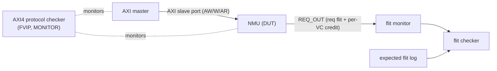
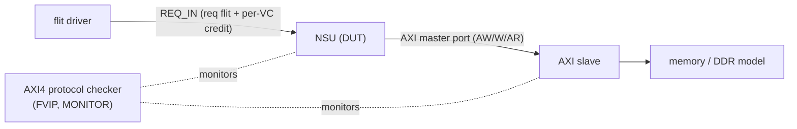
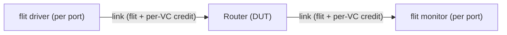
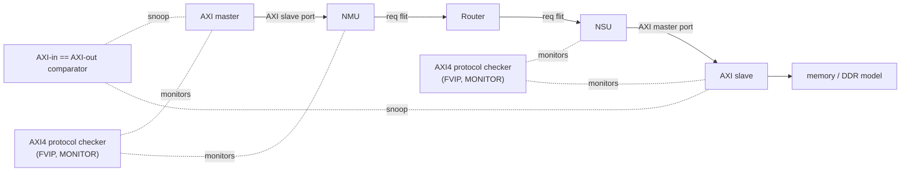

# Test Environment

本文件以驗證 stage 為主軸。Stage P0 定義所有 stage 共用的 pattern 與 4 種 testbench。P1 到 P3 各自套用這 4 種 testbench，只換 DUT 型態（C model 或 RTL）與執行環境。方法論見 §5、verification closure 見 §6，術語與 OSS 先例見 `verification_terminology.md`。Testpoint 與 coverage 清單見 `plan.md`。

---

## 0. Verification stage overview

驗證分四個 stage，由 C model 逐步交給 RTL。每個 stage 都跑同樣 4 種 testbench（NMU 單獨、NSU 單獨、Router 單獨、mixed），一套 pattern 沿用全程。

| Stage | DUT | C-model role | Environment | Exit criteria (V-milestone) |
|---|---|---|---|---|
| **P0 Pattern & TB foundation** | none (defines shared resources) | none | repo / build | pattern + 4 TBs ready |
| **P1 C model validation** | C model | DUT | Windows, C++ / GoogleTest or cocotb | C-model readiness gate (pre-V1, see §6.1) |
| **P2 RTL bring-up** | one or more RTL blocks | reference (DPI-C predictor) | Linux + VCS | RTL matches C, timing within tolerance (V1→V2) |
| **P3 RTL signoff** | full RTL | reference (retained) | Linux + VCS, UVM / SVA / formal | coverage 100% or waiver, formal proven, soak (V3) |

**三條原則**

1. 同一套 pattern 沿用 P1 到 P3，P3 另加 constrained-random。
2. 檢查逐 stage 轉移：P1 用公式與 loopback，P2/P3 用 C reference、SVA、coverage。
3. C model 角色轉移：P1 被驗，P2/P3 當 reference 並保留。

---

## 1. Stage P0: Pattern and testbench foundation

定義所有 stage 共用的 pattern 與 4 種 testbench。本身不算驗證，是 P1 到 P3 的前置。

### 1.1 Pattern generation

- 一支 Python 產生器產出輸入 pattern 檔（哪些檔由它產，見 §1.2 generation 欄）。
- 輸入：pattern type（§1.4）、mesh 大小、注入率、交易數、burst 分布。
- 輸出：每個 endpoint 一個 traffic-job + memory init。
- Pattern generator (custom Python script; see `verification_terminology.md` for tooling context)。

### 1.2 I/O file contract

所有檔案皆純文字或 hex，SV 端 `$fscanf` / `$readmemh` 直讀，不需 JSON parser。

| Pattern | in/out | Format | Generation | Note |
|---|---|---|---|---|
| Config | in | SV parameter + plusargs, text key=value for C | pattern gen or manual | configures DUT (mesh, width, dst node id, delays), does not drive interfaces |
| Memory init | in | `.hex` (`$readmemh`) | pattern gen | write-payload source, memory/DDR preload |
| Traffic job | in | per-endpoint text-job (§1.3) | pattern gen | one AXI transaction per line, AXI master replays each |
| Expected flit log | golden | text / CSV (one flit per line) | pattern gen | expected NMU flits, computed by pattern gen from the spec AXI-to-flit mapping (no OSS), used only for direct flit compare (see §1.5) |
| Memory state | out | `.hex` | DUT | byte-exact compare, verifies writes land |
| Response log | out | text / CSV (one txn per line) | DUT | compare data + resp-code + order, verifies read-back |
| Flit log | out | text / CSV (one flit per line) | DUT | compared against expected flit log |
| Stats | out | text / CSV | DUT | not compared (derived) |

memory_state 驗寫資料落地，response_log 驗讀回 rdata、resp code、per-ID 順序，兩者互補。

### 1.3 Traffic-job format

每個 mesh endpoint 一個 `.txt`，每筆 transaction 十行。範例：4x4 mesh、64KB/node，tile(1,1) 寫 2KB 到 tile(2,2)（node 編號換算 address = `(x*NUM_Y + y) * 64KB`）。

```
2048        # length，bytes
0x50000     # src_addr，tile(1,1) = (1*4+1)*64KB
0xa0000     # dst_addr，tile(2,2) = (2*4+2)*64KB
0           # src_protocol，0 = AXI
0           # dst_protocol，0 = AXI
256         # max_src_burst
256         # max_dst_burst
0           # r_aw_decouple
0           # r_w_decouple
0           # num_errors，大於 0 時後接 per-error 列
```

`dst_addr` 高位即 dst node id（本專案 `dst_addr[39:32] = node_id`），決定 flit 路由目標。一個 spatial pattern（§1.4）對每個 endpoint 套同一規則算 dst，產出整組 per-endpoint job。

### 1.4 Spatial traffic pattern

`uniform · transpose · bit_complement · bit_reverse · bit_rotation · shuffle · tornado · neighbor · hotspot · matmul · hbm`（出自 Dally & Towles 及業界常見 NoC 評測 patterns）。

### 1.5 Testbench configurations (4, shared across stages)

DUT 方塊在 P1 是 C model，P2/P3 是 RTL。每種 TB 下方列出 block 對應的 OSS 與 golden 方法。每個有 AXI 介面的 TB（A、B、D）都用 SV `bind` 在 AXI 互連上掛一個 AXI protocol checker（`amba_axi4_protocol_checker`，一個 instance bind 一組完整 AXI 介面 AW/W/B/AR/R）。

下圖為 **simulation** 視角：VIP 與 DUT 都是實體 block，checker 設 `VERIFY_AGENT_TYPE = MONITOR`，被動 assert 互連兩端（master 端與 slave 端）的協定、不 assume 任何一側。圖中虛線接到互連兩端，表示 tap 在這條 bus 上，而非綁在某一個 block。

TB-D 兩段 AXI 互連（NMU slave port、NSU master port）各 bind 一個。TB-C 為 flit-only，無 AXI 互連，故無此 checker。

**TB-A: NMU 單獨**



- 驗 NMU 把 AXI 交易封裝成 flit。
- flit-level golden 由 pattern gen 依 spec 的 AXI-to-flit mapping 產生（獨立於 DUT，無可重用 OSS）。或改用 TB-D loopback 做端到端 AXI 比對，不需 flit golden。

| block | OSS |
|---|---|
| AXI master | custom AXI master driver / `axi_file_master` |
| AXI protocol checker | SVA-AXI4-FVIP `amba_axi4_protocol_checker` |
| flit monitor | custom flit monitor |
| expected flit log | none (spec / C-model) |

**TB-B: NSU 單獨**



- 驗 NSU 把 flit 還原成 AXI。golden = memory_state byte-exact 加 response_log。

| block | OSS |
|---|---|
| flit driver | custom flit driver |
| AXI slave | custom AXI random slave driver |
| memory / DDR | functional: AXI RAM behavioral model; DDR timing: cycle-accurate DDR timing model |
| AXI protocol checker | SVA-AXI4-FVIP `amba_axi4_protocol_checker` |

**TB-C: Router 單獨**



- 驗 routing、VC、credit、wormhole、arbiter。golden = XY 公式 routing oracle 加 latency。Router 完整 spec 在 noc-sim router 文件（本文件只當 peer）。

| block | OSS |
|---|---|
| flit driver / monitor | custom flit driver / monitor |
| traffic pattern | XY routing oracle + standard NoC traffic patterns (pattern inspiration, not a bit-accurate golden) |

**TB-D: Mixed（full chain，loopback）**



- 全鏈 end-to-end：AXI master 經 NMU、Router、NSU、AXI slave 到 memory。
- golden 為 AXI-in 與 AXI-out 比對（允許跨 ID reorder、同 ID 保序），不依賴 flit golden 或 C model golden。
- 另比對 memory_state byte-exact 與 response_log。

| block | OSS |
|---|---|
| AXI master | custom AXI random master driver |
| AXI slave + memory/DDR | custom AXI random slave + AXI RAM behavioral model; cycle-accurate DDR model for DDR |
| AXI-in==AXI-out comparator | custom scoreboard (cross-ID reorder tolerated, same-ID order enforced) |
| AXI protocol checker | SVA-AXI4-FVIP `amba_axi4_protocol_checker` |

---

## 2. Stage P1: C model validation

**Goals**：驗 C model 本身正確，使其可作為 P2/P3 reference。

**Current status**：C model readiness gate（見 §6.1）。通過後 P2/P3 才可用它當 reference。

**Environment**：Windows，純 C++ / GoogleTest，免模擬器。若要一份 stimulus 同時驅 C 與 RTL，可改 cocotb（cocotb extension library for AXI）。

**Testbench**：套用 §1.5 的 4 種 TB，DUT 方塊 = C model（C NMU / C NSU / C Router / C full）。

| TB | DUT | golden / check |
|---|---|---|
| TB-A NMU | C NMU | flit checker (reference from spec/C, no OSS flit golden) |
| TB-B NSU | C NSU | memory_state + response_log |
| TB-C Router | C Router | XY oracle + latency |
| TB-D mixed | C full chain | **AXI-in == AXI-out loopback** (preferred, no flit golden needed) + memory_state + response_log |

**Self-checking**：將 `plan.md` 的 FAIL ABV rule replay 到 C model signal trace（見 §6.1）。
**Testplan**：對應 `plan.md` 的 NI C-model 項目。過關達 §6.1 readiness gate。

---

## 3. Stage P2: RTL bring-up

**Goals**：用已通過 P1 readiness gate 的 C model 當 reference，先驗一個或多個 RTL block。

**Current status**：V1 到 V2。前提是 P1 已過 readiness gate。

**Environment**：Linux + VCS。C model 經 DPI-C 包進同一 SV harness 當 reference predictor。RTL DUT 直接接 AXI master/slave VIP。

**Testbench**：套用 §1.5 的 4 種 TB，DUT 方塊 = 單一或多個 RTL block，C model 當 reference。

| TB | DUT | reference / check |
|---|---|---|
| TB-A NMU | RTL NMU | C NMU (DPI-C) computes expected flit, or use TB-D loopback |
| TB-B NSU | RTL NSU | memory_state + response_log (AXI slave + memory, no C reference needed) |
| TB-C Router | RTL Router | C Router (DPI-C) + XY oracle |
| TB-D mixed | RTL NMU+NSU(+Router) | **AXI-in == AXI-out loopback** + memory_state + response_log |

**時序**：從這裡開始對 RTL 校準（見 §6.3）。
**Testplan**：對應 `plan.md` 的 block-level testpoint。過關是 RTL block 對 C 一致、時序容差內、block coverage 達 V2。

---

## 4. Stage P3: RTL signoff

**Goals**：full RTL 為 DUT，C model 保留當 reference，最終收斂。

**Current status**：V3。

**Environment**：Linux + VCS，UVM / SVA / formal / nightly regression。

**Testbench**：以 §1.5 TB-D（mixed full RTL）為主，加 constrained-random，TB-A/B/C 作 corner 補強。AXI protocol checker 全程 bind。

| TB | DUT | check |
|---|---|---|
| TB-D mixed | full RTL + C reference | differential scoreboard (C reference) + AXI-in==AXI-out + memory_state + response_log + SVA + coverage |
| TB-A/B/C | full RTL block view | corner / coverage reinforcement |

**Self-checking**：differential（C reference 對 full RTL），data 與 response byte-exact，時序在 sync point 精確、整體 correlation（見 §6.3）。formal 另跑。
**Testplan**：對應 `plan.md` 全表。過關是 coverage 100% 或 waiver、formal proven、多 seed soak。部分項目（local SVA、FPV、coverage-only）不需 reference model。

---

## 5. Methodology

C model + RTL co-sim：C model 先完成功能與效能校準，再作為 RTL co-sim 的 reference。Scope = NI + Router（整個 NoC）。

**SV stack（預設）**：`plan.md` 已採 SV/UVM 結構（每條 FAIL rule 一條 SVA、covergroups、FPV），VCS 原生支援 SV/UVM/SVA/DPI-C，可重用 OSS 多為 SV。改用 cocotb 需重建 testplan、checker 與 coverage。例外：若需一份 stimulus 同時驅 C model 與 RTL，且 C model 不適合整合進 SV simulator，可改走 cocotb（cocotb extension library for AXI）。

C++ NoC perf model cosim 先例：見 `verification_terminology.md`。

---

## 6. Verification closure

採 V1/V2/V3 stage gate，非只看 coverage 數字：

| Stage | Convergence definition |
|---|---|
| V1 | every feature has testpoint + checker + coverage item + TB/scoreboard/assertion skeleton, smoke pass, nightly regression set up |
| V2 | functional coverage ≥ 90% and fully implemented, all assertions written, end-to-end scoreboard enabled, P0/P1 bugs closed |
| V3 | coverage 100% (or reviewed waiver), formal/assertion 100% proven, multi-seed soak ≥ 1 week all-pass, no unexplained waiver |

### 6.1 C-model self-correctness (reference prerequisite, P1)

C model 作為 reference 前，先完成以下獨立檢查：

| # | Readiness check | Oracle / method | TB |
|---|-----------------|-----------------|----|
| 1 | Protocol compliance | replay `plan.md` FAIL ABV rules on C-model signal trace | all TBs |
| 2 | Routing | XY formula oracle, all-pairs sweep vs realized hop sequence | TB-C |
| 3 | Zero-load latency | analytic zero-load latency oracle, C must ±0 match | TB-C / TB-D |
| 4 | Sub-block golden | frozen hand-derived golden vectors in `patterns/` | TB-A, TB-B |
| 5 | RoB + ECC formal | FPV proof (scoped in `plan.md`) | TB-A internal |
| 6 | End-to-end loopback | AXI master VIP drives full chain, compare AXI-in vs AXI-out | TB-D |

C model sign-off：上述全部通過。

### 6.2 Per-item closure criteria

| Convergence item | Closure criterion | Tools / assets | OT stage |
|---|---|---|---|
| C-model self-correctness | ABV pass on C-trace + frozen vectors + XY/latency oracle + RoB/ECC FPV + loopback | existing ABV/FPV + formula oracle + TB-D | pre-V1, reconfirm V2/V3 |
| C↔RTL equivalence | data/resp/memory byte-exact + ABV pass on both traces + AXI-in==AXI-out 0 mismatch | co-sim + ABV + TB-D | V2→V3 |
| AXI compliance | AXI protocol checker (SVA) 0 violation + rule→SVA→TP traceability | SVA-AXI4-FVIP | V1→V3 |
| AXI ordering / RoB | FPV proof per-ID order==issue order + `cg_rob_state_machine` 100% | existing FPV, custom AXI reorder comparator | V2/V3 |
| Routing | all-pairs realized hop == XY analytic | XY formula oracle | V2 |
| Credit conservation | invariant as always-on SVA, regression 0 violation | SymbiYosys | V2 / formal V3 |
| Deadlock freedom | acyclic CDG/VC proof + FPV arbiter liveness (not threshold heuristic) | VC Formal / SymbiYosys | V2 analysis / V3 formal |
| Wormhole | always-on SVA: first-grant→last=1 no foreign-packet flit, vc_id stable | SVA | V2/V3 |
| ECC | exhaustive single-bit FPV + double-bit sampling + `cg_ecc` 100% | secded_gen | V2/V3 |
| Performance | zero-load ±0 vs analytic + saturation curve + loaded ±5% vs RTL (timing axis: see §6.3) | analytic NoC baseline | V2/V3 |
| Cycle-accuracy | see §6.3 | directed microbench + RTL calibration | V3 selected configs |

### 6.3 Timing-axis closure (cycle-accuracy calibration, P2/P3)

cycle-accurate C model 的 timing 以 RTL 為基準，用 directed microbench 校準。不覆蓋所有 cycle-level microstate。

Microbench suite 的逐場景 testpoint（11 個 timing 場景 + 4 種 per-TB bring-up）見 `plan.md` §Timing microbench testpoints（TP56–TP66）與 §Per-testbench bring-up testpoints（TP52–TP55），各自標 stimulus、觀測點、expected、容差、stage / closure。

容差分級：single-clock deterministic path = ±0。CDC crossing = 明確 phase-dependent envelope。loaded aggregate = ±5%（perf correlation，非 cycle-exact equivalence）。

timing coverage 採 structural、microbenchmark、contention-scenario class。

Network-layer differential：移除 AXI，同一 topology 加 synthetic traffic，比對 router/link/VC/credit 的 hop latency 與 throughput，分離 NI overhead。僅 network/flit 層。

---

## 7. Related

- `plan.md`：testpoints、coverage model、ABV-FPV 清單。
- `verification_terminology.md`：標準術語、OSS 先例對映、驗證資源 OSS 清單、使用範圍與限制。
- `../doc/signal_interface.md` §Per-block interface summary：NMU / NSU / Router 介面定義。
- `../doc/packet_format.md`：flit 格式。
- AXI-to-flit mapping 權威來源（expected flit golden 依據）：`../doc/theory_of_operation.md`（NMU 封裝架構）、`../doc/protocol_rules.md`（WSTRB regen 等規則）。
- 系統級 C-model 平台與 co-sim 機制：noc-sim `docs/design/08_simulation.md`、`09_verification.md`。
