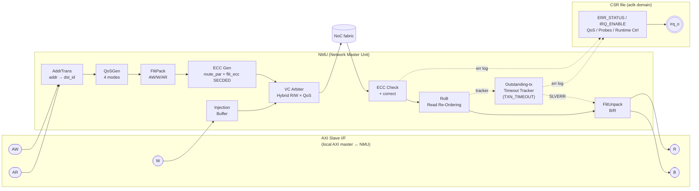

# NMU Block Diagram (our spec, post-A4.5)

Layout follows NoC IP datasheet convention (AXI side on the left, NoC side on the right) but with our actual sub-block decomposition.

> **Width conversion is external (bolt-on).** Per ToO §Data Width Conversion, an external Width Bridge between the local AXI master and the NMU AXI port (`NOC_DATA_WIDTH`) handles `AXI_DATA_WIDTH ↔ NOC_DATA_WIDTH`. The NMU itself does not convert width.

## Sub-block legend (one-line each)

| Block | Function |
|-------|----------|
| **AddrTrans** | AXI address → NoC `dst_id` + `local_addr`. XYRouting / SourceRouting / IDRouting |
| **QoSGen** | Generate flit `qos`. 4 modes: Bypass / Fixed / Limiter / Regulator |
| **FlitPack** | Pack AXI request fields into flit payload |
| **ECC Gen** | Compute `route_par` (1-bit even parity over `{dst_id, last}`, 9 bits) + `flit_ecc` (SECDED, 10-bit syndrome over 396-bit) |
| **Injection Buffer** | Per-VC FIFO buffering ready-to-inject flits |
| **VC Arbiter** | Hybrid R/W × QoS weighted RR. Fixed policy |
| **ECC Check** | Validate `flit_ecc` at endpoint. SECDED 1-bit correct / 2-bit detect (forward + log) |
| **RoB** | Per-AXI-ID order release. NoRoB / SimpleRoB / NormalRoB selectable |
| **FlitUnpack** | Reconstruct AXI B/R from response flit |
| **Outstanding-tx Timeout Tracker** | Per-entry timeout counter. On timeout: `bresp/rresp = SLVERR` + `ERR_STATUS[1]` + IRQ |

## Sub-block mapping (reference architecture → this spec)

| Reference NMU block | In our spec? | Note |
|---------------------|--------------|------|
| Address Map | ✓ (AddrTrans) | renamed |
| Packetizing | ✓ (FlitPack) | renamed |
| QoS Order Control | ✓ (QoSGen) | renamed |
| Read Re-Tagging Buffer | ✗ | AXI ID conversion not modelled at this layer |
| VC Mapping | ✓ (VC Arbiter) | richer (Hybrid R/W × QoS policy) |
| Write Buffer | ✓ (Injection Buffer) | renamed |
| Read Re-Ordering | ✓ (RoB) | renamed |
| De-Packetizing | ✓ (FlitUnpack) | renamed |
| **(not shown)** | **ECC Gen / Check** | added — two-layer integrity scheme (route_par + flit_ecc) |
| **(not shown)** | **Outstanding-tx Timeout Tracker** | added — sole AXI-rresp-generating mechanism on fabric error path |
| **(not shown)** | **CSR file + irq_o** | added — software-visible runtime control surface |
