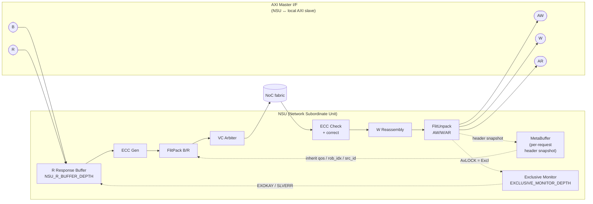

# NSU Block Diagram (our spec, post-A4.5)

Layout follows NoC IP datasheet convention (AXI side on the left, NoC side on the right) but with our actual sub-block decomposition.

> **Width conversion is external (bolt-on).** Per ToO §Data Width Conversion, an external Width Bridge between the NSU AXI port (`NOC_DATA_WIDTH`) and the local slave handles `AXI_DATA_WIDTH ↔ NOC_DATA_WIDTH`. The NSU itself does not downsize.

## Sub-block legend (one-line each)

| Block | Function |
|-------|----------|
| **ECC Check** | Validate `flit_ecc` at NSU sink. Single-bit silently corrected. Double-bit forwarded with logging |
| **W Reassembly** | Reassemble multi-flit W burst before driving to local slave |
| **FlitUnpack** | Reconstruct AXI request from request flit |
| **MetaBuffer** | Snapshot of request-flit header (`rob_idx`, `src_id`, `qos`, `axi_id`) for response-path inheritance |
| **Exclusive Monitor** | Track AXI4 Exclusive read reservations. `clear_all` via CSR. `EXOKAY` on match, `OKAY` on miss |
| **R Response Buffer** | Decouple local AXI slave R timing from NoC injection back-pressure. `NSU_R_BUFFER_DEPTH` entries |
| **ECC Gen** | Compute `route_par` + `flit_ecc` for outgoing response flits |
| **FlitPack B/R** | Pack AXI B/R into response flit. Inherit `qos` / `rob_idx` / `src_id` from `MetaBuffer` |
| **VC Arbiter** | Same Hybrid R/W × QoS policy as NMU |

## Sub-block mapping (reference architecture → this spec)

| Reference NSU block | In our spec? | Note |
|---------------------|--------------|------|
| Rate Matching + Async Boundary Crossing | ✓ (W Reassembly + R Response Buffer + MetaBuffer + CDC FIFO) | reference lumps four functions into one block; we explicitly separate them |
| De-Packetizing | ✓ (FlitUnpack) | renamed |
| Packetizing | ✓ (FlitPack B/R) | renamed |
| QoS | ~ partial | NSU does NOT recompute qos — only inherits from `MetaBuffer`. QoS Generator lives only in NMU |
| **(not shown)** | **Exclusive Monitor** | added — AXI4 Exclusive Access support (A3) |
| Down Size + chop | external bolt-on bridge | reference puts down/upsize inside NSU; this design externalizes it to a Width Bridge between the NSU AXI port and the local slave (structural divergence). See ToO §Data Width Conversion |
| **(not shown)** | **ECC Gen / Check** | added — two-layer integrity scheme |
| **(not shown)** | **MetaBuffer** | explicit — preserves request header for response inheritance |
